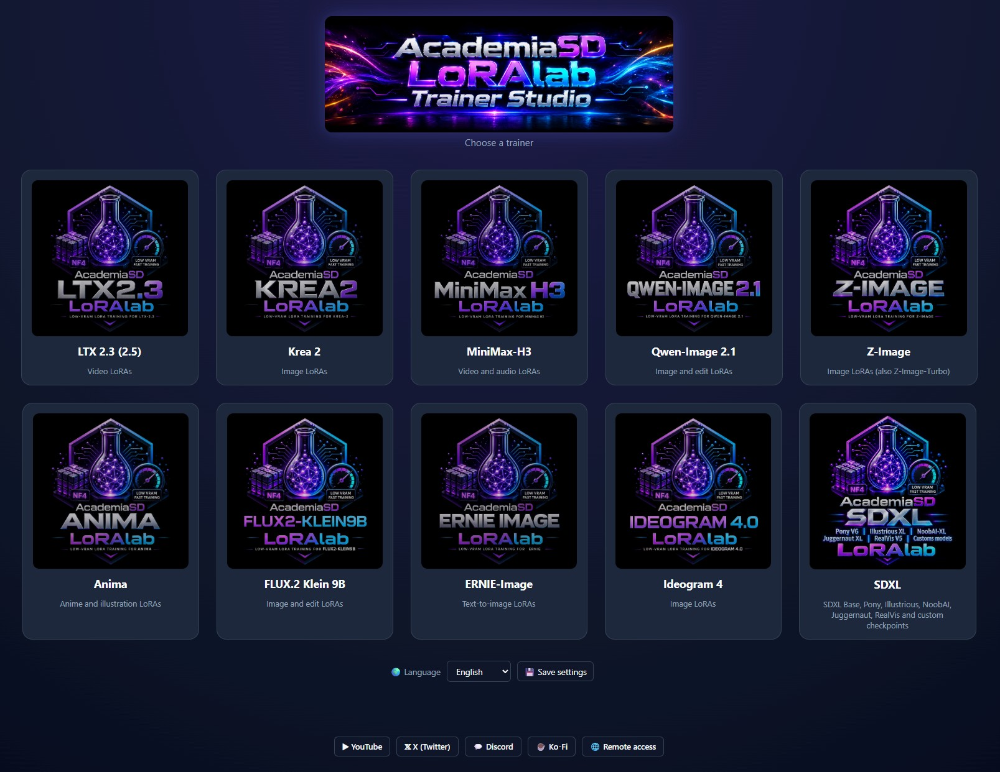

# AcademiaSD LoRAlab Trainer Studio

<p align="center">
  
</p>

<p align="center">
  <b>Train LoRAs for the latest image and video models on consumer NVIDIA GPUs — from 8 GB of VRAM.<br>
  One installation, one Python environment, one launcher. Every trainer in one place.</b>
</p>

<p align="center">
  
  
  
  
  
  
  
  <a href="https://console.runpod.io/deploy?template=lfxvtg5rrb&ref=jbvdshm0"></a>
</p>

> 🧪 **Aviso:** se ha añadido soporte a muchos modelos de forma casi simultánea. Es posible que haya bugs, ajustes pendientes o que las configuraciones de entrenamiento y de previsualización por defecto no sean las adecuadas. Por favor, escribe en [Issues](../../issues) contando los problemas que encuentres o los ajustes con los que has conseguido mejores resultados. ¡Gracias!
>
> Las previsualizaciones no tienen por qué tener la calidad del LoRA final: sirven para seguir la evolución del entrenamiento y el parecido del personaje, objeto o estilo. La calidad final del LoRA compruébala en su interfaz (ComfyUI, Forge...), después de ajustar la fuerza del LoRA y con los ajustes de calidad del modelo que uses.
>
> 🧪 **Notice:** support for many models has been added almost at the same time. There may be bugs or rough edges, or the default training and preview settings may not be the right ones. Please open an [issue](../../issues) with the problems you find or the settings that gave you better results. Thank you!
>
> The previews do not have to reach the quality of the final LoRA: they are there to follow the training and the likeness of the character, object or style. Judge the final quality in the matching interface (ComfyUI, Forge...), after adjusting the LoRA strength and with the quality settings of the model you use.

**AcademiaSD LoRAlab Trainer Studio** brings together all the AcademiaSD LoRAlab trainers. Each model is loaded in **4-bit NF4**, the text encoder and the VAE run only once in a **pre-cache** stage, and 100 % of the GPU goes to training. Every trainer has the same web interface: dataset manager with an automatic captioner, live previews, exact-step resume and one-click export to ComfyUI. It also works from another device on your network: upload the dataset and download the LoRA from the browser.

New trainers are added **here**. One `Update_LoRAlab-TrainerStudio.bat` brings them to your existing installation, next to your models and projects — no new repository, no new environment.

| Trainer | Trains | Minimum VRAM |
| :--- | :--- | :--- |
| **Qwen-Image 2.1** | Image LoRAs (characters, objects, styles) **and edit LoRAs** (before → after) | 8 GB |
| **Krea 2** | Image LoRAs (characters, objects, styles) for Krea 2 Raw and Turbo | 8 GB |
| **Z-Image** | Image LoRAs (characters, objects, styles) for Z-Image and Z-Image-Turbo | 8 GB |
| **Anima** | Anime and illustration LoRAs (characters, styles) | **4 GB** (NF4) / 6 GB (BF16) |
| **FLUX.2 Klein 9B** | Image LoRAs (characters, objects, styles) **and edit LoRAs** (before → after) | 12 GB |
| **Ideogram 4** | Image LoRAs (characters, objects, styles), with JSON captions | 12 GB (16 GB for previews with CFG) |
| **SDXL** | Image LoRAs for SDXL Base, Pony, Illustrious, NoobAI, Juggernaut, RealVis or your own SDXL checkpoint | **4 GB** (NF4) / 12 GB (BF16) |
| **LTX-2.3** (also LTX-2.5) | Character and style LoRAs for the LTX video model, trained from images | 12 GB |
| **MiniMax-H3** | Video LoRAs from images, clips and audio, plus training-free **RefMods** | 8 GB |

---

## 🇪🇸 Guía rápida en español

1. **Instalar:** en la carpeta donde quieras instalarlo, escribe `cmd` en la barra de direcciones del explorador y ejecuta
   `git clone https://github.com/AcademiaSD/AcademiaSD_LoRAlab-TrainerStudio.git`
   (o descarga el ZIP desde el botón verde **Code → Download ZIP** y descomprímelo). Después, doble clic en **`Install_LoRAlab-TrainerStudio.bat`**: instala Git si no lo tienes, Python 3.13.1 y un único entorno `venv` para todos los entrenadores.
2. **Abrir:** doble clic en **`Start_LoRAlab-TrainerStudio.bat`** y pulsa la tarjeta del entrenador que quieras. Solo puede haber uno abierto a la vez.
3. **Entrenar:** nombre del proyecto → carpeta del dataset → *Crear Captions* (opcional) → *Iniciar Pre-Caché* → *Iniciar / Reanudar* → *Send to Models*. El modelo se descarga solo la primera vez.
4. **Actualizar:** doble clic en **`Update_LoRAlab-TrainerStudio.bat`**. Se conservan tus modelos, proyectos y ajustes, los nuevos entrenadores aparecen en el lanzador y se instalan las librerías nuevas que hagan falta.
5. **Desde otro equipo:** el botón **🌐 Remote access** del lanzador abre el entrenador a tu red con usuario y contraseña. Con **⬆ Subir** (o arrastrando archivos o un `.zip` al Dataset Manager) mandas el dataset desde ese equipo, y con **⬇ Descargar LoRA** te bajas el resultado.
6. **Previsualizaciones nítidas en ComfyUI:** algunos de estos modelos son lentos al generar, y conviene ver el resultado de forma anticipada, mientras se genera, para cancelar si no va bien. Para eso hace falta una buena previsualización. Mi recomendación: al usar tus LoRAs de Qwen-Image 2.1, Krea 2 o FLUX.2 / Klein 9B, pon el nodo **Model Preview Override** de [KJNodes](https://github.com/kijai/ComfyUI-KJNodes) con el TAE de AcademiaSD correspondiente ([Qwen-Image 2.1](https://huggingface.co/AcademiaSD/TAE-Qwen-Image-2.1) · [Krea 2](https://huggingface.co/AcademiaSD/TAE-Krea-2) · [FLUX.2](https://huggingface.co/AcademiaSD/TAE_Flux2_AcademiaSD)) en `ComfyUI/models/vae_approx/`. Detalles en la sección *Sharp previews in ComfyUI*.
7. **Sin GPU potente:** entrena en la nube con **[RunPod](https://console.runpod.io/deploy?template=lfxvtg5rrb&ref=jbvdshm0)**. Es una plantilla ya preparada: eliges una GPU con CUDA 13, entras con el usuario `loralab` y la contraseña que aparece en *Logs → Container*, y al terminar paras y borras el pod. Detalles en la sección *RunPod*.
8. **Requisitos:** Windows 10/11, GPU NVIDIA **RTX 20xx / GTX 16xx o posterior** con driver **580 o superior**, 8 GB de VRAM (4 GB para Anima y SDXL en NF4, 12 GB para LTX-2.3, FLUX.2 Klein 9B, Ideogram 4 y SDXL en BF16) y 16 GB de RAM (32 GB recomendados).

**Linux:** ya tiene soporte para Linux. Cada `.bat` tiene su `.sh` equivalente; la instalación y el uso están en [docs/Linux.md](docs/Linux.md). Gracias a **[Jonathan Hecl (@jonathanhecl)](https://github.com/jonathanhecl)** por aportarlo.

**Idiomas:** la interfaz y los mensajes de consola están en inglés, español, alemán, francés, portugués, italiano, japonés y coreano. Elige el idioma en el selector **🌍 Language** de la parte inferior del lanzador y pulsa **💾 Save settings**; por defecto está en inglés. Los prompts de los captions siguen siempre en inglés, que es lo que entienden los modelos. Detalles en la sección *Languages*.

> ⚠️ **Sobre los valores por defecto:** las pruebas se han hecho para comprobar que cada entrenamiento funciona, no para buscar el mejor rendimiento ni la mejor calidad. Haz tus propias pruebas con distintas configuraciones (pasos, learning rate, rank, resolución, captions) para mejorar la calidad de tus LoRAs.

---

## 📉 Smaller downloads

Each trainer downloads **only what it uses**, already quantized. The table compares the official full-precision model, what the previous standalone LoRAlab downloaded, and what Trainer Studio downloads now (sizes from the Hugging Face repositories, in GB):

| Trainer | Official model | LoRAlab before | **Trainer Studio now** | What changed |
| :--- | ---: | ---: | ---: | :--- |
| **Krea 2** | 62.0 | 43.2 | **17.0** | The BF16 transformer (26.3 GB) is no longer downloaded or used: the model is built directly from its NF4 weights. |
| **LTX-2.3** | 101.3 | 111.1 | **32.2** | The BF16 transformer (38.0 GB) and the FP32 Gemma 3 text encoder (48.8 GB) are replaced by NF4 versions (9.8 GB + 7.8 GB). |
| **Qwen-Image 2.1** | ~32 (BF16) | 21.9 | **21.9 / 14.4 / 11.0** | Only the text encoder you pick is downloaded: BF16 (exact, default) / INT8 / NF4. |
| **MiniMax-H3** | 498.5 | 41.4 | **41.4** | The 33B model ships in NF4 from the start. |
| **Z-Image** | 20.5 | — | **5.9** | New trainer: the 6B transformer (12.3 GB) and the Qwen3-4B text encoder (8.0 GB) in NF4 (3.4 GB + 2.7 GB). |
| **Anima** | 5.6 | — | **5.6** | New trainer: the official diffusers version of Anima-Base. The 2B model trains in BF16, or in NF4 quantized when loading (nothing extra to download). |
| **SDXL** | ~7 per model | — | **~7 per model** | New trainer: only the preset you pick is downloaded (one `.safetensors` file); your own checkpoint downloads nothing. |
| **Ideogram 4** | 16.1 (NF4) | — | **16.1** | New trainer: the official NF4 release, which includes the unconditional transformer used only by the previews. It is downloaded from Unsloth's ungated mirror (same weights, no license gate or token needed); the Ideogram license still applies. |
| **FLUX.2 Klein 9B** | 34.7 | — | **8.8** | New trainer: the 9B transformer (18.2 GB) and the Qwen3-8B text encoder (16.4 GB) in NF4 (4.9 GB + 3.8 GB; only the 28 text encoder layers Klein reads). |

The automatic captioner adds, only the first time you use it: **nothing** for Krea 2 (it uses Krea 2's own text encoder), **5.5 GB** for Qwen-Image 2.1 when its text encoder is not already the NF4 one and for LTX-2.3, Z-Image, Anima, FLUX.2 Klein 9B and Ideogram 4 (Qwen3-VL-8B NF4, shared by all of them), and **8.9 GB** for MiniMax-H3 (Qwen3-VL-4B).

> **Upgrading from an old standalone LoRAlab?** Copy its model folder into Trainer Studio instead of downloading it again. Then you can delete what is no longer used: `Krea-2-NF4/transformer` (~26 GB) and, in `LTX23-NF4`, the `transformer` (~38 GB) and `text_encoder` (~49 GB) folders.

---

## 🖥️ Requirements

| | Minimum | Recommended |
| :--- | :--- | :--- |
| **OS** | Windows 10 / 11, or 64-bit Linux ([docs/Linux.md](docs/Linux.md)) | Windows 11 |
| **GPU** | NVIDIA **RTX 20xx / GTX 16xx or newer** (compute capability 7.5+) with **8 GB VRAM** (4 GB for Anima and SDXL in NF4, 12 GB for LTX-2.3, FLUX.2 Klein 9B, Ideogram 4 and SDXL in BF16) | 12–24 GB VRAM |
| **Driver** | NVIDIA **580 or newer** (CUDA 13) | Latest |
| **RAM** | 16 GB | 32 GB |
| **Disk** | The model of each trainer you use (table above) plus your datasets and caches | SSD |
| **Other** | Internet the first time each model is used. MiniMax-H3 video clips need **`ffmpeg`** in the `PATH`. | |

Python, Git and every library are installed by the installer. GTX 10xx and older cards are **not** supported: PyTorch for CUDA 13 starts at the RTX 20xx generation.

---

## 📦 Installation

**Option A — Git (recommended, makes updating easy).** Open the folder where you want to install it, type `cmd` in the address bar of the Windows Explorer, press Enter and run:

```bash
git clone https://github.com/AcademiaSD/AcademiaSD_LoRAlab-TrainerStudio.git
```

**Option B — ZIP.** Press the green **Code** button → **Download ZIP** and unzip it where you want to install it (the folder is called `AcademiaSD_LoRAlab-TrainerStudio-main`).

Then, inside the folder:

1. Double-click **`Install_LoRAlab-TrainerStudio.bat`**. It installs Git if it is missing (Windows asks for permission), Python 3.13.1 if it is missing, and one `venv` shared by every trainer: PyTorch 2.14 (CUDA 13.0), Diffusers from GitHub, Transformers, PEFT, bitsandbytes, Flask and the rest. It takes a while; at the end it shows the detected GPU and versions.
2. *(Optional)* Double-click **`Install_Triton&SageAtten220.bat`** for Triton and SageAttention 2.2.

Pick a disk with plenty of free space: every model is downloaded into this folder.

**Linux.** Every `.bat` has a `.sh` equivalent with the same name (`Install_LoRAlab-TrainerStudio.sh`, `Start_LoRAlab-TrainerStudio.sh`, `code/Run_LoRAlab-<Model>.sh`…) and the launcher picks the right one. Install and usage steps are in [docs/Linux.md](docs/Linux.md).

## 🔄 Updating

Double-click **`Update_LoRAlab-TrainerStudio.bat`**. It brings the latest version from GitHub — including any new trainer — and keeps your models, datasets, projects, LoRAs and settings, which are never part of the repository. Then it installs any new or updated library from `requirements.txt`, the single list the installers and the updater share. If the installation was made from the ZIP, the updater turns it into a Git installation the first time.

---

## 🚀 Using it

**`Start_LoRAlab-TrainerStudio.bat`** opens the launcher in your browser (`http://127.0.0.1:4990`). Click a trainer: its console window and its web interface (`http://127.0.0.1:5000`) open on their own. All trainers use port 5000, so only one can be open at a time; the launcher warns you if one is already running. Each trainer can also be started directly with its `code\Run_LoRAlab-<Model>.bat`.

Every trainer follows the same five steps:

1. **Project and dataset.** Type a project name, an optional trigger word, and pick the dataset folder with **Browse**. Each image needs a `.txt` caption with the same name. From another device, **⬆ Upload** in the Dataset Manager (or dragging files or a `.zip` onto it) copies them into that folder.
2. **Captions** *(optional)*. **Create Captions** writes a caption for every image with a vision-language model, trigger word first. The prompt is editable and **Overwrite** off only fills the missing ones. Review them in the **Dataset Manager**: click an image to edit its caption, use **Append / Replace / Remove** to change a common text in every caption, delete images, clear all captions, or empty the whole dataset folder with **Clear Dataset** (it asks you to type the number of files; subfolders are kept).
3. **Pre-Cache.** Choose the resolution and press **Start Pre-Cache**. The text encoder and the VAE run once and their output is stored on disk; the first time, the model is downloaded. Running it again skips the images that did not change.
4. **Train.** Set steps, learning rate, rank and alpha, and press **Start / Resume**. Watch the progress, VRAM, RAM and GPU temperature, and the previews (each trainer has its own previews panel). **Stop Training** saves the exact step: press **Start / Resume** again — even days later — to continue without losing a step. To train longer, raise the steps and press it again.
5. **Export.** Type the final name, pick your ComfyUI / Forge / A1111 `models/loras` folder and press **Save Path** — the folder is remembered for **every** trainer — then **🚀 Send to Models**. **⬇ Download LoRA** lists the final LoRA and the step checkpoints and saves the one you pick on the device you are browsing from.

Also in every trainer:

- **Live settings:** while training, change steps, save/preview frequency, preview settings or learning rate and press **Save JSON**; the change applies on the next step.
- **Delete Pre-Cache / Delete Training** empty the current project's folders (the dataset is never touched).
- Exported LoRAs carry kohya-style metadata (trigger word, rank, steps, resolution) that CivitAI and LoRA managers read.
- Optional **Hugging Face token** for faster downloads. Your settings and token are stored in `settings\`, which is never uploaded.
- Each project uses its own folders: `cached_data_<model>_<project>` for the pre-cache and `<model>_lora_output_<project>` for checkpoints, previews and LoRAs.

---

## 🎛️ LoRA options: rsLoRA, LoRA+ and LoKr

Under **LoRA Rank / Alpha**, the trainers have extra checkboxes. They change **how** the LoRA learns, so they are fixed for the whole training (to change them, *Delete Training* and start again; the pre-cache is reused).

| Option | What it does | Trainers |
| :--- | :--- | :--- |
| **rsLoRA** | Scales the LoRA by `alpha/√rank` instead of `alpha/rank`, so high ranks keep learning. Ticking it lowers alpha to keep the same strength. | Z-Image, FLUX.2 Klein 9B, Qwen-Image 2.1, Krea 2, Anima, Ideogram 4, SDXL |
| **LoRA+** | The `B` matrix of every layer learns 16× faster than `A`: usually the same quality in fewer steps. Lower the LR if it burns early. | same as rsLoRA |
| **LoKr** + **Factor** | Replaces LoRA with a Kronecker product (LyCORIS). Much smaller files (~3 MB instead of ~40 MB at rank 8), good for characters with small datasets, more sensitive to the LR. rsLoRA and LoRA+ turn off. | Z-Image, FLUX.2 Klein 9B, Qwen-Image 2.1, Krea 2, Anima |

- The exported file is a **standard LoRA / LyCORIS file** that ComfyUI and Forge load as usual (with rsLoRA, the alpha is converted so it acts exactly as trained).
- **Send to Models** and **⬇ Download LoRA** add **`_rs`**, **`_plus`** or **`_lokr`** to the name, taken from the file's own metadata, so you always know how it was trained. The *Final LoRA Filename* field shows the suffix as you tick the boxes.
- No extra VRAM: LoKr never builds the full weight matrix, and the other two only change the scaling and the optimizer.

---

## 🌍 Languages

The launcher, every trainer interface and the console messages are available in **English, Español, Deutsch, Français, Português, Italiano, 日本語 and 한국어**. English is the default.

1. At the bottom of the launcher, pick a language in **🌍 Language**: the launcher switches at once, as a preview.
2. Press **💾 Save settings**. The choice is stored in `settings/ui.json` and applies to every trainer.
3. A trainer page that is already open changes after reloading it; the scripts (captioner, pre-cache, training) use the new language on their next run.

What stays in English on purpose:

- **Caption prompts and the captions themselves**, because that is the language the models were trained on.
- Technical names and log tags: settings such as `vram_budget_gb` or `max_seq_len`, markers such as `[NF4-TE]` or `[BACKFILL]`, model names and paths.
- The `.bat` and `.sh` windows of the installer, the updater and the launchers.

**Improving a translation.** Each language is one file, `GUI/locales/<code>.json` (`es`, `de`, `fr`, `pt`, `it`, `ja`, `ko`). The key is the English text and the value is its translation:

```json
{
  "Start Pre-Cache": "Iniciar Pre-Caché",
  "{n} images inside": "{n} imágenes dentro"
}
```

Keep every `{marker}` of the English text, in the same order when it has no name (`{}`). A text with no translation is shown in English, so nothing breaks while a translation is incomplete; edit the file, reload the page, and the change is there. The German, French, Portuguese, Italian, Japanese and Korean translations are first versions: if a term sounds wrong in your language, open an [issue](../../issues) or a pull request with the fix.

---

## 🖼️ Sharp previews in ComfyUI

Some of these models are slow to generate, so it pays to see where an image is going early on, while it is still sampling, and cancel it if it is not working. That needs a good preview, and ComfyUI's default one for Qwen-Image 2.1, Krea 2 and FLUX.2 is Latent2RGB, a blurry, blocky color projection.

My recommendation: **kijai's KJNodes** plus **AcademiaSD's tiny decoders (TAE)**. They show a real image at every step, in milliseconds and without loading the full VAE:

| Model | TAE | File |
| :--- | :--- | :--- |
| Qwen-Image 2.1 | [AcademiaSD/TAE-Qwen-Image-2.1](https://huggingface.co/AcademiaSD/TAE-Qwen-Image-2.1) | `TAEQwenImage21_AcademiaSD.safetensors` |
| Krea 2 | [AcademiaSD/TAE-Krea-2](https://huggingface.co/AcademiaSD/TAE-Krea-2) | `TAE_Krea2_AcademiaSD.safetensors` |
| FLUX.2 and FLUX.2 Klein 9B | [AcademiaSD/TAE_Flux2_AcademiaSD](https://huggingface.co/AcademiaSD/TAE_Flux2_AcademiaSD) | `TAE_Flux2_AcademiaSD.safetensors` |

1. Download the file to `ComfyUI/models/vae_approx/`.
2. Install [ComfyUI-KJNodes](https://github.com/kijai/ComfyUI-KJNodes) by kijai.
3. Add the **Model Preview Override** node between the model (with your LoRA) and the sampler, and pick the TAE in its `tiny_vae` input.

ComfyUI's built-in TAESD preview method does not load these files: use the KJNodes node. They are for previews only; the final image is still decoded with the real VAE.

## 🧪 The trainers

> ⚠️ **About the default settings:** the tests were made to check that every training works, not to find the best performance or quality. Run your own tests with different settings (steps, learning rate, rank, resolution, captions) to improve the quality of your LoRAs.

All times were measured on an RTX 5080 16 GB.

### Qwen-Image 2.1 — image and edit LoRAs

- **Normal LoRAs** (characters, objects, styles): one image + one caption each.
- **Edit LoRAs**: pairs named `name_before.png` / `name_after.png` plus the instruction in `name.txt` (for example `make it TOSTIOK style`). Choose **LoRA Type → Edit**. The "before" image goes through the text encoder with the instruction, like the ComfyUI `TextEncodeQwenImage21` node, and the loss is computed only on the "after".
- **Captioner:** Qwen3-VL-8B, the model's own text encoder in NF4 (~6 GB VRAM, ~11 s per image), with **Normal** and **Edit** modes. For a style or effect, one common instruction in every pair usually works better than one per pair.
- **Text encoder for the pre-cache:** BF16 with CPU offload (exact, any GPU, default), BF16 (16 GB+ VRAM), INT8 (~9 % error, 10 GB+) or NF4 (~24 % error, 6 GB+). With 8 GB of VRAM and 16 GB of RAM, choose NF4.
- **Previews:** 30 steps / CFG 3, or **Turbo** (Viggle Turbo LoRA, 4 steps / CFG 1: ~5 s instead of ~34 s). For edit LoRAs, pick a **before** image that is **not** in the dataset: it is the only way to see whether the effect generalizes.
- **LoRA Targets:** *Blocks* (attention + MLP of the 32 blocks, default) combines cleanly with the Turbo LoRA; *All* also trains the shared modulation and input/output layers.

| Verified starting point | Characters | Edits |
| :--- | :--- | :--- |
| Resolution | 512×512 | 512×512 |
| Rank / Alpha | 8 / 8 | 8 / 8 |
| Learning rate | 4e-4 | 4e-4 |
| Steps | 500 (~9 min 20 s) | 300 with 30 pairs (~9 min) |

8 GB cards train at 512² and 768² (previews switch to a tiled VAE decode at 768²). 768²: ~2.2 s/step, ~8.4 GB VRAM; 1024²: ~4.3 s/step.

### Krea 2 — image LoRAs for Krea 2 Raw and Turbo

- The 12B transformer is built directly from its **NF4** weights (no BF16 copy is ever downloaded or loaded): ~7.5 GB of VRAM while training.
- **Captioner:** Qwen3-VL-4B, Krea 2's own text encoder (NF4, ~3.5 GB VRAM, no extra download).
- **Previews** with the Krea 2 Turbo LoRA (8 steps). A new custom preview prompt is encoded on the CPU without stopping the training.
- 8-bit AdamW, gradient checkpointing, Krea 2's own noise-shift schedule.
- The exported LoRA works with Krea 2 Raw and Krea 2 Turbo and carries its alpha, so ComfyUI applies it at the same strength as the previews.

| Starting point | |
| :--- | :--- |
| Resolution | 512×512 (768×768 / 1024×1024 need more steps and VRAM) |
| Rank / Alpha | 16 / 32 |
| Learning rate | 3e-4 |
| Steps | 500–1000 at 512² (~1,500 at 768², ~2,000 at 1024²) |
| Time | 500 steps, 14 images, 512²: ~15 min (RTX 3060 12 GB: ~1 h 30 min) |

### Z-Image — image LoRAs for Z-Image and Z-Image-Turbo

- Trains on **Z-Image** (the undistilled base model, the one meant for fine-tuning). The LoRA has the same layers as **Z-Image-Turbo** and also loads there.
- The 6B transformer is built directly from its **NF4** weights, and the Qwen3-4B text encoder of the pre-cache is NF4 too: ~5.5 GB of VRAM while training at 512².
- **Captioner:** Qwen3-VL-8B NF4, shared with LTX-2.3 (~5.5 GB VRAM, ~10 s per image).
- **Previews:** 28 steps / CFG 5 (CFG as in ComfyUI: 1 = off), or **Turbo** with Alibaba PAI's **Z-Image-Fun-Lora-Distill** (made for Z-Image base, 4 steps / CFG 1, about 10 times faster; downloaded the first time, ~570 MB). **Preview Size** renders them at the training size or at 768 / 1024 with the same proportions, to see what you will get in ComfyUI even when training at 512 (1024 with Turbo: ~5 s, ~6.4 GB of VRAM).
- **LoRA Targets:** *Blocks* (attention + MLP of the 30 blocks and the 4 refiners, default) or *All*. ComfyUI loads the exported LoRA directly.
- **Steps count micro-steps:** with Grad Accum 4 the LoRA is updated once every 4 steps, so 1,500 steps are 375 updates. The likeness shows in the previews much earlier, but a 900-step LoRA still needed a strength of ~2.6 in ComfyUI.

| Verified starting point | |
| :--- | :--- |
| Resolution | 512×512 |
| Rank / Alpha | 8 / 8 |
| Learning rate | 4e-4 |
| Steps | 1,500 (14 images) |
| Time | ~0.9 s/step at 512²: ~23 min plus previews |
| LoRA strength in ComfyUI | **Z-Image: 1.0–1.5** · **Z-Image-Turbo: 1.5–2.5** |

### Anima — anime and illustration LoRAs

- **Anima** is a 2B anime / illustration model by CircleStone Labs and Comfy Org, built on NVIDIA Cosmos-Predict2. The trainer uses **Anima-Base**, the version its author recommends for LoRAs, downloaded from the official diffusers repository.
- **Model Precision:** *BF16* (full quality, ~5.6 GB of VRAM while training at 512²) or *NF4* (attention and MLP quantized when loading, ~3.1 GB at 512²: it fits **4 GB** cards). Images from the NF4 transformer look like the BF16 ones.
- The text goes through Qwen3-0.6B and Anima's **LLM adapter** in the pre-cache. The adapter is **never trained**, as the author advises: it holds a lot of the model's knowledge and degrades easily.
- **Captioner:** Qwen3-VL-8B NF4, shared with LTX-2.3 and Z-Image, with two styles: **natural language** or **Danbooru tags** (lowercase, spaces instead of underscores). Anima was trained on both.
- **Previews:** 30 steps / CFG 4 with the author's recommended negative prompt, and **Preview Size** as in Z-Image.
- The LoRA is exported with Anima's own layer names (`diffusion_model.blocks.N.self_attn.q_proj`…), which ComfyUI loads directly.

| Starting point (author's recommendation) | |
| :--- | :--- |
| Resolution | 768×768 (Anima works from 512² to 1536²) |
| Rank / Alpha | 32 / 32 |
| Learning rate | 2e-5 |
| Speed | ~0.65 s/step at 512² in BF16, ~0.8 s/step in NF4 (under 4 GB of VRAM); ~1.6 s/step at 1024² in BF16 |

### FLUX.2 Klein 9B — image and edit LoRAs

- Trains on **FLUX.2 [klein] Base 9B** (the undistilled model, the one meant for fine-tuning). The LoRA also loads on the distilled **FLUX.2 [klein] 9B**; it is not compatible with the 4B models.
- The 9B transformer and the Qwen3-8B text encoder of the pre-cache are **NF4**: 8.8 GB to download instead of 34.7 GB.
- **Normal LoRAs** (characters, objects, styles) and **Edit LoRAs** with the same `name_before.png` / `name_after.png` pairs as Qwen-Image 2.1. Klein's text encoder only reads the instruction: the "before" goes to the transformer as a clean reference image, as in the official pipeline, and the loss is computed only on the "after".
- **Captioner:** Qwen3-VL-8B NF4, shared with LTX-2.3, Z-Image and Anima, with **Normal** and **Edit** modes.
- **Previews:** 28 steps / CFG 4, or **Turbo** with kalle07's Klein 9B turbo LoRA (4 steps / CFG 1; downloaded the first time, ~350 MB), and **Preview Size** as in Z-Image.
- **LoRA Targets:** *Blocks* (attention + MLP of the 8 double and 24 single blocks, default) or *All*. ComfyUI loads the exported LoRA directly.

| Verified starting point | |
| :--- | :--- |
| Resolution | 768×768 |
| Rank / Alpha | 16 / 16 |
| Learning rate | 3e-4 |
| Steps | 1,000 (14 images): the likeness shows from ~500, but in ComfyUI the 1,000-step LoRA looks better than the 600 and 700 ones |
| LoRA strength in ComfyUI | 1.0 for characters (1,000 steps) · 1.0–1.5 for edit LoRAs |
| Speed and VRAM | 512²: ~1.5 s/step, ~8 GB · 768²: ~2.6 s/step, ~10 GB · edit at 512²: ~2.3 s/step, ~8 GB · edit at 768²: ~5.7 s/step, ~11 GB |

### Ideogram 4 — image LoRAs

- Trains on the official **Ideogram 4 NF4** release (9.3B, diffusers). It is a single-stream transformer: text and image tokens share one sequence.
- **Captioner:** Qwen3-VL-8B NF4 (the same model as Ideogram's text encoder) writes Ideogram's native JSON caption with a **bounding box for every subject, object and piece of text** — the format Ideogram 4.5 and FLUX.3 Image will also use. A second **OCR pass** reads every sign with its box (in one pass the model misses many texts in busy scenes). **JSON detailed** also boxes each part of every person or animal (face, nose, ears, hands, legs...), each garment and accessory, for edit LoRAs. Captions are saved in the official format (key order, `[y1, x1, y2, x2]` boxes in 0–1000, no repeated elements) with the trigger word at the start of the description. **Natural language** is also available.
- **Use JSON for captions and preview prompts.** Ideogram 4 depends on its JSON format: in our tests a short plain prompt ("a woman with blonde hair in a green sweater reading in a library") gave odd crops or was blocked, while the same scene written as a JSON caption came out right. For the custom preview prompt, copy a caption from the dataset and edit it.
- **Previews:** 28 steps / CFG 7 with the last 3 steps at CFG 3, as in the official pipeline. Ideogram's guidance uses a second, **unconditional transformer** (4.3 GB): it is loaded only for the previews and moved to the GPU while each one runs, so previews with CFG need ~15 GB at 1024². On 12 GB cards set **Preview CFG to 1**. **Preview Size** as in Z-Image.
- **Built-in safety filter:** Ideogram 4 was trained to output a grey "Image blocked by safety filter" image for some prompts (for example a woman at the beach). It is the model itself, not the trainer, and its license forbids circumventing it: change the preview prompt if it happens.
- **LoRA Targets:** *Blocks* (attention + MLP of the 34 blocks, default) or *All*. The LoRA is exported with ComfyUI's own layer names (q, k and v merged into `attention.qkv`), so ComfyUI loads it directly.

| Tested starting point | |
| :--- | :--- |
| Captions | Ideogram JSON |
| Resolution | 1024×1024 |
| Rank / Alpha | 16 / 16 |
| Learning rate | 3e-4 |
| Steps | 1,000 (14 images): the likeness shows from ~500 |
| LoRA strength in ComfyUI | 1.0 |
| Speed and VRAM | ~5.7 s/step (~1 h 35 min for 1,000 steps plus previews) and ~10 GB at 1024²; ~15 GB during previews with CFG |

### SDXL — Base, Pony, Illustrious, NoobAI, Juggernaut, RealVis or your own checkpoint

- **Base Model** picks what the LoRA is trained on. Each preset is downloaded the first time (~7 GB) into `SDXL-Models/`:

  | Preset | Best for | Captions | Quality prefix (optional) · Preview CFG |
  | :--- | :--- | :--- | :--- |
  | SDXL Base 1.0 | general, realistic | natural | CFG 6 |
  | Juggernaut XI v11 | photorealistic | natural | CFG 5 |
  | RealVisXL V5.0 | photorealistic | natural | CFG 5 |
  | Pony Diffusion V6 XL | anime, cartoon, furry | tags | `score_9, score_8_up, score_7_up` · CFG 7 |
  | Illustrious XL v0.1 | anime | Danbooru tags | `masterpiece, best quality` · CFG 6 |
  | NoobAI-XL 1.1 | anime | Danbooru tags | `masterpiece, best quality, newest` · CFG 5 |
  | Custom checkpoint | any SDXL `.safetensors` (Juggernaut Ragnarok, WAI...) | either | CFG 6 |

  A LoRA works best on the model it was trained on and on models derived from it: train on Illustrious v0.1 for Illustrious-based checkpoints such as WAI or NoobAI.
- **Captioner:** Qwen3-VL-8B NF4 (shared), with **natural language** or **Danbooru tags**. Long captions are encoded in blocks of 75 tokens (up to 225), as kohya does.
- **Model Precision:** *BF16* or *NF4*, which quantizes the transformer blocks to 4 bits when loading and fits in a **4 GB GPU**. The first training run on a model saves its converted UNet in `SDXL-Models/unet_cache/` (~5 GB on disk); from then on it loads with ~5.5 GB of RAM instead of ~14 GB.
- **Training:** the UNet with gradient checkpointing, noise prediction with Min-SNR weighting (γ = 5). **LoRA Targets:** *Blocks* (attention, MLP and projections of the transformer blocks, kohya's default) or *All* (+ the resnet convolutions, LoCon).
- **Quality prefix in captions** (Pony, Illustrious, NoobAI; off by default): puts the preset's prefix (`score_9, score_8_up, score_7_up` for Pony) before every caption and the preview prompt. Off, the previews show the LoRA alone; on, use the LoRA with that prefix in ComfyUI.
- **Previews:** Euler, 28 steps, with the preset's negative prompt. **Preview CFG 0** uses the preset's recommended value.
- The LoRA is exported in **kohya format** (`lora_unet_…`), which ComfyUI, Forge, A1111 and CivitAI load.
- **Grad Accum** multiplies the steps: with Grad Accum 4, 800 steps are only 200 LoRA updates. Style LoRAs on SDXL usually need around 1,000–3,000 updates.

| Tested on Pony (Greg Rutkowski style, 153 images) | BF16 | NF4 (low VRAM) |
| :--- | :--- | :--- |
| Resolution | 1024×1024 | 512×512 |
| Rank / Alpha | 16 / 16 | 8 / 8 |
| Steps / Grad Accum / LR | 1000 / 1 / 1e-4 | same (quality not yet compared) |
| Speed | ~1.1 s/step | ~1.5 s/step |
| VRAM | ~10.8 GB with the previews | ~3.5 GB, previews at 768² included |
| RAM | ~5.5 GB | ~5.5 GB |

The LoRA works at strength 0.8–1.2; at 2.0 it breaks anatomy.

### LTX-2.3 — character and style LoRAs for the LTX video model

- Works with **LTX-2.3 and LTX-2.5**.
- Trains from **images** (single frames) to teach a character or a style to the video model.
- The 22B transformer and the Gemma 3 text encoder come pre-quantized in NF4; the BF16 / FP32 originals are never downloaded (see the table above).
- **Captioner:** Qwen3-VL-8B NF4 (~5.5 GB VRAM, ~13 s per image).
- Paged 8-bit AdamW and gradient checkpointing.

| Default starting point | |
| :--- | :--- |
| Resolution | 768×768 (448 / 576 / 512 for less VRAM) |
| Rank / Alpha | 32 / 32 |
| Learning rate | 1e-4 |
| Steps | 800 |

### MiniMax-H3 — video, audio and RefMods

MiniMax-H3 is a 33B model that generates **video and audio together**. The official checkpoint is 498.5 GB; this trainer uses a 41 GB NF4 version and fits in 8 GB of VRAM with **block swap**.

- **Datasets:** images, video clips (`.mp4`, `.mov`, `.mkv`, `.webm`), audio (`.wav`, `.mp3`, `.flac`, `.m4a`) or a mix, each with its `.txt`. Images teach appearance; clips teach how something **changes over time**.
- **Prepare clips:** one button leaves every clip at **24 fps** with a valid **17n+5** frame count, stretching time slightly instead of cutting the end. Originals are kept in `_originals\`.
- **Captioner:** Qwen3-VL-4B (4-bit, ~4.2 GB VRAM, ~6 s per image), with one prompt per content type (image, video, audio).
- **VRAM profiles** for 32 / 24 / 16 / 12 / 10 / 8 GB cards size the block swap to your resolution and captions; choosing a smaller card than yours simulates it. Parked blocks can live in RAM, on disk (for 16 GB of RAM) or switch automatically.
- **RefMod:** encodes a few reference stills or clips into a file that ComfyUI's `MiniMaxH3ReferenceToVideo` node uses as a native reference. No training: seconds instead of hours.
- **Audio** as part of video clips trains well. **Audio-only training is still experimental:** past a point it degrades the video branch.
- fp32 LoRA and optimizer (8-bit optimizers lose the fine facial detail on this model), deterministic sampling across resumes, and a full log in `train_log.txt`.

| Verified starting point | Images | Video clips |
| :--- | :--- | :--- |
| Resolution | 576×576 | 192×192, 124 frames |
| Rank / Alpha | 16 / 16 | 8 / 8 |
| Learning rate | 2e-4 | 2e-4 |
| Steps | 600 (~37 min on 16 GB) | 600 (~1 h 10 min on 16 GB) |

Rank 16 matters for characters: with rank 8 the likeness is just as good, but the model starts ignoring the prompt (ask for a beach, get a bedroom). On an 8 GB card the same image run takes ~80 minutes instead of 37.

---

## ☁️ RunPod

No suitable GPU at home? Train in the cloud with the ready-made template:

<a href="https://console.runpod.io/deploy?template=lfxvtg5rrb&ref=jbvdshm0"></a>

1. Pick a GPU (the template only allows machines with **CUDA 13**). 24 GB or more is comfortable; SDXL and Anima also train on 16 GB. Cheap cards cost around $0.25–0.50 per hour.
2. Keep the 100 GB volume: models, datasets and LoRAs are stored in `/workspace`.
3. Open **Logs → Container** and wait for `Open / Abre: https://<pod>-4990.proxy.runpod.net` (the first start takes a few minutes). Log in with user `loralab` and the password printed just above it, or set `LORALAB_PASSWORD` when deploying to choose your own.
4. Pick a trainer, upload your dataset with **⬆ Upload** (images and captions, or a `.zip`), pre-cache, train and save the result with **⬇ Download LoRA**.
5. **When you finish, Stop and then Terminate the pod.** Closing the browser does not stop billing, and a stopped pod still pays for its volume.

The image ([`ghcr.io/academiasd/loralab-trainerstudio`](https://github.com/AcademiaSD/AcademiaSD_LoRAlab-TrainerStudio/pkgs/container/loralab-trainerstudio)) only holds the environment; the code comes from this repository on every start, so the pod always runs the latest version. `LORALAB_REF` pins a branch or tag. The image is built from `docker/` by GitHub Actions. The deploy link includes the AcademiaSD referral code, which gives the channel RunPod credit at no cost to you.

## 🌐 Remote access

The launcher and the trainers are web pages, so you can train from a laptop, a tablet or a phone while the GPU works on another PC. By default they only answer this PC (`127.0.0.1`).

1. On the training PC, click **🌐 Remote access** at the bottom of the launcher.
2. Tick **Allow other devices on the network**, set a **user and password** and, if you need them, other ports (4990 for the launcher, 5000 for the trainers).
3. Restart the launcher. The panel shows the address to open from the other device, e.g. `http://192.168.1.20:4990`.

- The training PC never asks for the password; other devices always do. Without a password, network access is refused.
- **Behind a reverse proxy** that already asks for a login (Authelia, Authentik, Cloudflare Access...), tick **I use my own authentication** to drop the built-in login, and set **Trainer public URL** (e.g. `https://trainer.example.com`) so the launcher links there instead of `host:5000`. Without a proxy with authentication in front, that option leaves the PC open to anyone on the network.
- On Windows, allow Python through the firewall the first time it asks (private networks).
- **Browse** buttons open a dialog on the training PC's screen, so from another device the folder ones switch to the web folder browser, and for files you type the path.
- **⬆ Upload** in the Dataset Manager (or dragging files onto it) sends images, captions or a whole `.zip` from your device to the dataset folder, and **⬇ Download LoRA** under *Send to Models* saves the trained LoRA on your device.
- The settings can only be changed from the training PC and are saved in `settings/network.json` (the password as a hash).
- It is plain HTTP, meant for your home network. **Do not open these ports to the Internet**: to connect from outside, use [Tailscale](https://tailscale.com) or an SSH tunnel (`ssh -L 4990:localhost:4990 -L 5000:localhost:5000 user@training-pc`).

## 🐍 Using your own Python environment

The installers create `venv\` and install everything there. To use your own environment instead (conda, uv...), install `requirements.txt` in it and set **`LORALAB_PYTHON`** to its python before starting; every launcher uses it instead of `venv\`:

```bat
set LORALAB_PYTHON=C:\Users\you\miniconda3\envs\loralab\python.exe
Start_LoRAlab-TrainerStudio.bat
```

```bash
LORALAB_PYTHON=~/miniconda3/envs/loralab/bin/python ./Start_LoRAlab-TrainerStudio.sh
```

It needs Python 3.13, the CUDA 13.0 build of PyTorch (`requirements.txt` takes it from the PyTorch index), diffusers from its main branch and, for MiniMax-H3 clips, ffmpeg on the PATH.

## 📚 Technical notes

Detailed measurements and the reasoning behind each design decision are in `docs\`: [Qwen-Image 2.1](docs/README_QwenImage21.md) · [Krea 2](docs/README_Krea2.md) · [LTX-2.3](docs/README_LTX23.md) · [MiniMax-H3](docs/README_MiniMaxH3.md) (VRAM tables, block swap, video and audio datasets, RefMods and every setting) · [Linux](docs/Linux.md).

## 🛠️ Tools for advanced users

`tools\` contains the scripts used to build the NF4 models from the originals (`Run_Conversor_Krea2.bat`, `Run_Conversor_LTX23.bat`, `5_conversor_QwenImage21_NF4.py`, `5_conversor_ZImage_NF4.py`, `5_conversor_Klein9B_NF4.py`) and a `.parquet` dataset extractor for Qwen-Image 2.1 (`6_extract_parquet.py`). They are not needed to train: the trainers download the ready-made NF4 models.

## 📁 Structure

```text
AcademiaSD_LoRAlab-TrainerStudio/
├── Start_LoRAlab-TrainerStudio.bat   # Launcher (.sh on Linux)
├── Update_LoRAlab-TrainerStudio.bat  # Updater (.sh on Linux)
├── Install_LoRAlab-TrainerStudio.bat, Install_Triton&SageAtten220.bat (and their .sh)
├── requirements.txt                  # Dependencies, for your own environment (LORALAB_PYTHON)
├── code/                             # Run_LoRAlab-<Model>.bat / .sh
├── scripts/                          # launcher.py, server_<model>.py, 0_caption / 1_pre_cache / 2_train_lora, remote_access.py, file_transfer.py, i18n.py, lora_options.py, refmod.py, melband/
├── GUI/                              # launcher.html, launcher.json, trainer_ui_<model>.html, i18n.js
│   └── locales/                      # Translations: <language>.json (English is the built-in text)
├── docs/                             # Technical notes per trainer
├── assets/                           # Covers and logos
├── tools/<model>/                    # NF4 converters and dataset tools
├── Example_Dataset/                  # Small example dataset (MiniMax-H3)
└── settings/                         # Your settings, HF token, network.json and ui.json (created on first use, never uploaded)
```

Models (`Krea-2-NF4`, `LTX23-NF4`, `MiniMax-H3-NF4`, `Qwen-Image21-NF4`, `Z-Image_NF4`, `Anima-Base`, `FLUX.2-Klein-9B_NF4`, `Ideogram4-NF4`, `SDXL-Models`, captioners), caches and LoRA outputs are created next to these folders on first use.

---

## 📜 Licenses

The code is released under the **MIT License**. The models keep their own licenses, which also apply to the NF4 versions and to the LoRAs you train — check them before using or sharing results:

| Model | License |
| :--- | :--- |
| Qwen-Image 2.1 (and the Viggle Turbo LoRA) | Qwen Research License — non-commercial |
| Krea 2 | Krea 2 Community License |
| LTX-2.3 | LTX-2 Open-Source License |
| MiniMax-H3 | MiniMax-H3 Community License Agreement |
| Z-Image (and the Z-Image-Fun-Lora-Distill preview LoRA) | Apache 2.0 |
| Anima | CircleStone Labs Non-Commercial License (plus the NVIDIA Open Model License for Cosmos). Images you generate can be used commercially |
| FLUX.2 Klein 9B (and the Klein 9B turbo preview LoRA) | FLUX Non-Commercial License — non-commercial |
| Ideogram 4 | Ideogram Non-Commercial Model Agreement — non-commercial; LoRAs are model derivatives under the same license |
| SDXL Base 1.0, RealVisXL V5.0 | CreativeML Open RAIL++-M |
| Pony Diffusion V6 XL, Illustrious XL v0.1, NoobAI-XL 1.1 | Fair AI Public License 1.0-SD |
| Juggernaut XI v11 | CC BY-NC-ND 4.0 — non-commercial |
| Qwen3-VL-4B (MiniMax-H3 captioner) | Apache 2.0 |

Built with PyTorch, Diffusers, Transformers, PEFT, bitsandbytes, Flask and the Hugging Face Hub.

## 🙏 Contributors

- **[Jonathan Hecl (@jonathanhecl)](https://github.com/jonathanhecl)** — Linux support ([PR #1](https://github.com/AcademiaSD/AcademiaSD_LoRAlab-TrainerStudio/pull/1)). Thank you!

## 🧩 Third-party code and credits

Code adapted or copied from other projects, and the work it builds on:

| Project | Used for | License |
| :--- | :--- | :--- |
| [Fizgig](https://github.com/shootthesound/Fizgig) by [@shootthesound](https://github.com/shootthesound) | MiniMax H3 sigma sampling (`sample_sigmas`) and the video VAE encoder (`MiniMaxH3VideoVAEEncoder`), adapted | Apache-2.0 |
| [ComfyUI](https://github.com/Comfy-Org/ComfyUI) | Origin of the MiniMax H3 video VAE that Fizgig ported; native layer names and LoRA layouts the exports follow | GPL-3.0 |
| [Diffusers](https://github.com/huggingface/diffusers) | Model classes and pipelines; MiniMax H3 audio positions copied from `build_packed_sequence` | Apache-2.0 |
| [Mel-Band-Roformer-Vocal-Model](https://github.com/KimberleyJensen/Mel-Band-Roformer-Vocal-Model) by KimberleyJensen | `scripts/melband/mel_band_roformer.py`, vendored with its source header (vocal separation for MiniMax H3 audio datasets) | not stated |
| [BS-RoFormer](https://github.com/lucidrains/BS-RoFormer) by lucidrains | Architecture the Mel-Band RoFormer code derives from | MIT |
| [librosa](https://github.com/librosa/librosa) | Mel filter bank reimplemented in `scripts/melband/mel_converter.py` | ISC |
| [ai-toolkit](https://github.com/ostris/ai-toolkit) by ostris | Reference for the MiniMax H3 LoRA key layout and the caption text-encoder allowlist | MIT |
| [LyCORIS](https://github.com/KohakuBlueleaf/LyCORIS) by KohakuBlueleaf | The LoKr method in `scripts/lora_options.py`: Kronecker factorization, initialization and `lokr_*` key layout (reimplemented for NF4 layers) | Apache-2.0 |
| [rsLoRA](https://arxiv.org/abs/2312.03732) (Kalajdzievski) and [LoRA+](https://arxiv.org/abs/2402.12354) (Hayou, Ghosh, Yu) | The `alpha/√rank` scaling and the separate learning rate for `lora_B` | papers |
| [kohya-ss sd-scripts](https://github.com/kohya-ss/sd-scripts) | `ss_*` LoRA metadata convention, SDXL LoRA key format and 75-token caption chunking | Apache-2.0 |

Models and LoRAs downloaded at run time (not part of this repository): MelBandRoFormer weights by [Kijai](https://huggingface.co/Kijai/MelBandRoFormer_comfy), the Klein 9B turbo preview LoRA by [kalle07](https://huggingface.co/kalle07/FLUX.2-klein-9B-turbo-lora-set), the Qwen-Image 2.1 turbo LoRA by [Viggle](https://huggingface.co/Viggle/Qwen-Image-2.1-viggle-turbo), Z-Image-Fun-Lora-Distill by [Alibaba PAI](https://huggingface.co/alibaba-pai/Z-Image-Fun-Lora-Distill), and the ungated Ideogram 4 NF4 mirror by [Unsloth](https://huggingface.co/unsloth/ideogram-4-nf4-diffusers). Thanks to all of them.

## 💬 Community & Support

- ▶ **YouTube**: [youtube.com/@Academia_SD](https://www.youtube.com/@Academia_SD)
- 𝕏 **X (Twitter)**: [twitter.com/Academia_S_D](https://twitter.com/Academia_S_D)
- 💬 **Discord**: [discord.gg/Syuaduy678](https://discord.gg/Syuaduy678)
- ☕ **Ko-Fi**: [ko-fi.com/academiasd](https://ko-fi.com/academiasd)

Developed with ❤️ by **AcademiaSD**.
