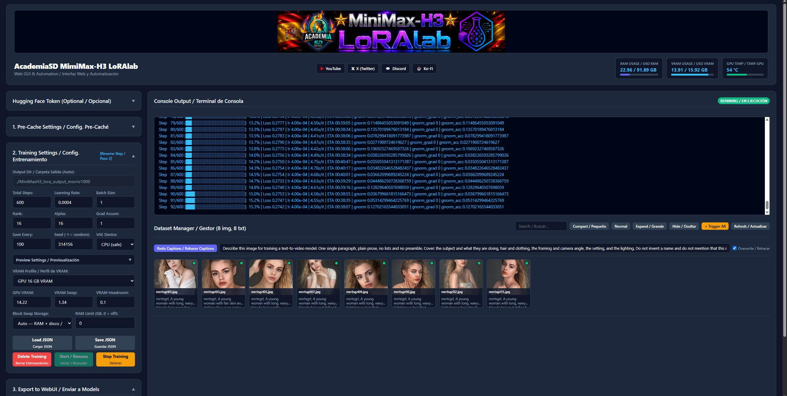

# MiniMax-H3 trainer — technical notes

> **Technical notes** for the MiniMax-H3 trainer of **AcademiaSD LoRAlab Trainer Studio**. Installation, updating and everyday use are in the [main README](../README.md).


<p align="center">
  <b>Train MiniMax-H3 character, style and video-effect LoRAs on a consumer GPU — a 33-Billion parameter joint video+audio DiT, from 8 GB of VRAM.</b>
</p>

<p align="center">
  
  
  
  
  
</p>

---

<p align="center">
  
</p>

---

## 🎯 What this is

**MiniMax-H3** is a 33-Billion parameter Diffusion Transformer that generates video **and audio jointly**, from a single packed sequence. The official checkpoint is **498 GB**; the generic partition alone is **135 GB**. Training a LoRA on it normally means datacenter hardware.

**AcademiaSD LoRAlab MiniMax-H3** trains character and style LoRAs from a folder of **images and captions**, on a **16 GB consumer GPU**, in about **40 minutes** — and down to **8 GB** if you are patient.

> **Verified result:** 8 images at **576×576**, **600 steps**, LR 2e-4, **rank/alpha 16** → excellent likeness *and* full prompt obedience, confirmed in ComfyUI video generation and tested alongside several Turbo LoRAs. These are the shipped defaults. On an RTX 5080 (16 GB) that is about **~3.7 s/it**, roughly **37 minutes**.

> **Why rank 16 and not rank 8.** Rank 8 produces an equally good likeness for less VRAM, which makes it look like the better deal — but it is not. With only 8 directions per matrix the adapter runs out of room for the identity and starts occupying directions the base model was using for composition. The symptom is subtle and easy to misread: the face is perfect, and the model stops obeying the prompt. Ask for a beach and you get a bedroom. Rank 16 has room for the identity without evicting anything, so likeness and prompt adherence improve together.

This trainer takes **images, video clips, or both in the same folder**. Images teach appearance; clips teach how something *changes over time* — a transition, a transformation, a camera move. **Audio is trained too**, from clips that carry a soundtrack or from standalone audio takes — though training audio *on its own* is still in development and takes the video branch down with it past a point; the audio section below says exactly where that line is.

> **Verified result (video):** 9 clips of **5.2 s** at **192×192**, **124 frames**, 600 steps, LR 2e-4, **rank/alpha 8** → the effect reproduces cleanly at strength 1.0 in `FL2VA`. Total time **1 h 10 min** on a 16 GB card. Clips are far more forgiving of low resolution than faces are, because what the LoRA has to learn is *motion*, not detail.

---

## 🔬 Technical Deep-Dive: how a 33B model fits in 16 GB or less.

### 1. 📉 The model is compressed 135 GB → 39 GB

* **4-bit NormalFloat (NF4) quantization**: the 50-block DiT backbone and the Qwen3-VL-32B text encoder are stored as `Linear4bit` NF4 weights. Measured on disk: **135 GB → 39 GB**. Only **86,474,752** parameters are trainable — **0.26 %** of the model's 33,209,467,648.
* **Precision-critical modules stay in float**: the model declares `proj_in`, `audio_proj_in`, `time_embedder`, `proj_out`, `audio_proj_out` and `rope` as `_keep_in_fp32_modules`. These plus the modulation path (`norm_out`, `context_embedder`, `token_refiner`) are reloaded **without** NF4 from a `precision_critical` section of the quantized repo. Quantization error there breaks the final AdaLN cancellation.
* **Adjustable block swap**: transformer blocks are parked outside VRAM and streamed in just in time, with a **hard cap** (`set_per_process_memory_fraction`) so the process physically cannot exceed its budget. This is what lets you *simulate* a smaller card and know whether a run would fit on 12 GB before you own one.

* **Frozen weights never travel home** (`nf4_cpu_home`): the NF4 weights are read-only, so once a block's CPU-side bytes exist they stay valid forever. The swap uploads them and then simply releases the GPU copy, instead of downloading 0.28 GB back over PCIe every time — which, at ~94 block evictions per step, was **26 GB of pointless PCIe traffic and 94 allocate/free cycles per step**. Removing it **halved the step time on every profile** and cut system RAM from 28.8 GB to 17.1 GB on a 16 GB card. Those CPU-side bytes are the memory-mapped checkpoint itself, so the trainer's hard RAM requirement is **2.2 GB**; the rest is file-backed and the OS can reclaim it.
* **RefMods without training**: the same VAEs encode reference stills into a `models/refmods` file that ComfyUI attends to as a native reference. No weights move, so it cannot cause the audio/video collapse a trained LoRA can — and it cannot teach anything new either. Seconds instead of hours; the cost is paid in tokens on every generation afterwards.
* **Zero VRAM spent on encoders**: during training **neither the text encoder nor the VAE are loaded**. Every embedding and latent is computed once, offline, in the pre-cache stage.
* **fp32 LoRA weights and optimizer state**: deliberately *not* 8-bit. On H3 the per-parameter LoRA gradients are tiny; `AdamW8bit` quantizes `exp_avg_sq` (squared gradients ~1e-6) and destroys exactly the low-magnitude components where facial detail lives. The result is a LoRA that gets pose, hair and framing right and leaves the face soft. fp32 costs ~6 bytes/param and fixes it.

### 2. ⚡ Why it is fast

* **No per-step encoding**: 100 % of GPU compute during training goes to the DiT forward/backward. No VAE, no 32B language model in the loop.
* **(1,2,2) patch packing**: video latents are packed into 2×2 spatial patches, cutting the self-attention sequence length 4×.
* **Reentrant gradient checkpointing**: `bitsandbytes` stashes its quantized weight as a plain `ctx` attribute rather than through `save_for_backward`, so non-reentrant checkpointing does **not** discard it — every executed `Linear4bit` would pin its NF4 weight in VRAM until backward, and the block swap would silently stop working. Reentrant checkpointing runs the forward under `no_grad`, so nothing is pinned.
* **Pinned RAM and non-blocking transfers** for the cached latents and embeddings.

### 3. 🎨 Why the likeness is preserved

* **The exact H3 conditioning**: MiniMax-H3 conditions on the **unnormalized hidden state after decoder layer 50** of Qwen3-VL-32B — not the last layer, not a normalized one. The pre-cache truncates the 64-layer stack to 50 and replaces the final norm with `Identity`, so `hidden_states[50]` is the raw layer-50 output the model expects.
* **The exact VAE convention**: ImageNet-normalized pixels over a `[0,1]` base (not the usual `[-1,1]`), then per-channel `(z − latents_mean) / latents_std`.
* **The exact flow-matching convention**: `noised = (1−σ)·x0 + σ·noise`, timestep `t = 1−σ` in `[0,1]` **unscaled** with `t = 1` meaning *clean*, and a data-ward velocity target of `x0 − noise`. H3 inverts the sign relative to standard flow-match schedulers.
* **The correct sigma schedule**: logit-normal sampling with the resolution-dependent shift `mu = 0.5 + (tokens−256)·(1.15−0.5)/(6400−256)`. The video sampler's `shift = 12.0` is **wrong for training** and ruins likeness.
* **Correct export keys**: the trained adapter is translated from the diffusers module layout to the original checkpoint layout that ComfyUI loads — including the **SwiGLU half swap on `mlp.fc1`** (the reference stores `[gate; value]`, diffusers stores `[value; gate]`) and the QKV fusion. Getting this wrong produces a LoRA that visibly changes the output while learning nothing about your subject.

---

## ✨ Features

### Training
- **🌐 Modern Web GUI** — pre-cache, dataset editing, training, previews, checkpoints and export from a single-page Flask app.
- **🎛️ VRAM profiles** — a dropdown with presets for **32, 24, 16, 12, 10 and 8 GB** cards. Every field stays editable by hand; the dropdown switches to *Custom* the moment you type, so it never advertises a preset that does not match your values.
- **💽 Block swap storage** — parked blocks live in **RAM** (default), on **disk** as a memory-mapped file, or **Auto**, which keeps them in RAM until a system-RAM ceiling you set would be crossed and spills the rest. Disk is not a speed option — it measured the same as RAM — but the memory it uses is evictable, so a machine short on RAM degrades instead of running out. The file is sized to the blocks actually parked and deleted when training ends.
- **⏱️ Exact-step resume** — stop at any step and continue from it. The checkpoint is written atomically with a strict invariant (weights → optimizer → step file, and the step file only if the first two succeeded), so a kill mid-write can never leave an inconsistent resume point.
- **🎲 Deterministic across pauses** — the RNG is seeded **per step** with a splitmix64 mix of `(seed, step)`, and the dataset sampler is a shuffled per-epoch permutation derived from the same step index. Step N always sees the same image, sigma and noise whether it came from one continuous run or ten resumes.
- **🔁 Live settings** — edit preview settings, `save_every`, `lr`, `max_grad_norm` or lower `total_steps` **while training is running**, press *Save JSON*, and the change lands on the next step. Costs one `getmtime` per step.
- **📈 Total training time** — reported bilingually at the end (e.g. `2 Hours 26 Minutes / 2 Horas 26 Minutos`), accumulated across resumes.
- **📝 Full run log on disk** — everything the console shows is mirrored to `<output_dir>/train_log.txt`, flushed on every write, so a crash or a closed browser tab never loses the history.

### Previews
- **🖼️ In-training previews** — every N steps the current LoRA generates an image, shown live in the gallery. `0` disables it completely.
- **🎬 Real joint sampling** — the preview runs the actual packed `[text | audio | video]` sequence with two independent sigma schedules and per-row timesteps, which is the layout the model was trained on.
- **🗣️ Four prompt modes** — *First* (comparable across steps), *Random* (varied), *Rotate* (covers the dataset), *Custom* (a free prompt, encoded by the pre-cache).
- **💾 VAE on CPU or CUDA** — the VAE decoder is ~2.4 G parameters (4.8 GB in bf16). On CPU it costs ~90 s and touches no VRAM; on a 24 GB+ card, CUDA takes seconds.
- The previews are of very poor quality and the generation times are long; it is recommended to activate it only on GPUs with a lot of VRAM.

### Dataset Manager
- **🖼️ Visual grid & caption editor** — caption status badges (🟢 present / 🔴 missing), filename overlays, a lightbox to edit `.txt` captions directly on disk, and a batch tool to inject trigger words.
- **🤖 Auto-captioning** — one button writes a caption for every image with **Qwen3-VL-4B-Instruct**, trigger word first. The button reads *Create Captions* or *Redo Captions* depending on what already exists, and asks before overwriting. The prompt is editable, so you can steer the style without touching code.
- **🎬 Video clips** — clips render as playable cards with film-sprocket borders and play on hover; click to open one full size with transport controls.
- **✂️ Prepare clips** — one button leaves every clip at exactly **24 fps** with a valid **17n+5** frame count, **without cutting anything off the end**: it resamples and stretches time by the couple of percent needed to reach a valid count. Originals are kept in `_originals/`.
- **🏷️ One caption prompt per content type** — a selector switches between the **image**, **video** and (reserved) **audio** prompts. An image is described by what it *looks like*, a clip by what *changes*; the same prompt cannot do both.
- **🗑️ Per-image delete** — a trash icon on each thumbnail removes the image **and its `.txt`** from disk, with a confirmation naming the file.
- **🧹 Delete project data** — two buttons wipe the current project's **pre-cache** or **training output**, each behind its own confirmation. They refuse to run while a process is active, since deleting underneath a running trainer leaves it writing into a checkpoint that no longer exists.
- **📊 Dataset summary** — image count, epochs, and the video-token grid, reported before training starts so you can plan the next experiment.

### System
- **📊 Real-time telemetry** — RAM, VRAM and GPU temperature with colour coding.
- **🔑 Hugging Face token support** — optional, stored in `settings\HF_token.json`, for faster downloads with live progress.
- **📂 Automatic project folders** — `./cached_data_minimaxh3_<project>` and `./minimaxh3_lora_output_<project>`.
- **🚀 One-click export** — send the finished `.safetensors` to your ComfyUI / Forge / A1111 `models/loras` folder.
- **🌐 Fully bilingual (English / Español)** — every message is `English / Español` on the same line, English first.

---

## 🖥️ System Requirements

| Requirement | Minimum | Recommended |
| :--- | :--- | :--- |
| **OS** | Windows 10/11 | Windows 11 |
| **GPU** | NVIDIA, **8 GB VRAM** | NVIDIA, **16–24 GB VRAM** |
| **System RAM** | **16 GB** with disk swap (see below) | **32 GB** |
| **Disk** | **45 GB** for the NF4 model, **+8 GB** if you use auto-captioning | 60 GB+ |
| **Driver** | NVIDIA 580+ (CUDA 13), RTX 20xx or newer | Latest |

### VRAM profiles

The three VRAM fields are **computed, not fixed**. Pick your card in the dropdown — or **Auto** to detect it — and the trainer sizes them for *your* resolution and *your* caption lengths, because both change how much VRAM a step needs. Picking a size smaller than your card **simulates** it, which is how you find out whether a run would fit on a 12 GB GPU without owning one.

Typical values with short captions, at the default 576×576 and at 768×768:

| Card | GPU VRAM @576² | @768² | Blocks @576² | Blocks @768² | s/it @576²*|
| :--- | ---: | ---: | ---: | ---: | ---: |
| 32 GB | 21.22 | 21.22 | 50 of 50 | 50 of 50 | no swap |
| 24 GB | 21.22 | 21.22 | 50 of 50 | 50 of 50 | no swap |
| **16 GB** | **14.22** | **13.89** | **29 of 50** | **28 of 50** | **~3.7** |
| 12 GB | 10.22 | 9.56 | 17 of 50 | 15 of 50 | ~5.8 |
| 10 GB | 7.89 | 7.23 | 10 of 50 | 8 of 50 | ~7.1 |
| 8 GB | 5.89 | 5.23 | 4 of 50 | 2 of 50 | ~8.1 |

** Estimated speed for an RTX 5080 with 16GB of VRAM.
`Swap` stays at **1.34** and `Headroom` at **0.1** for every card.

**What the low end really costs.** Every swapped block costs about **0.18 s/it**, measured. An 8 GB card keeps only 4 of the 50 blocks resident, so a step takes ~8.1 s against ~3.7 s on a 16 GB card: a 600-step run is about **80 minutes** instead of 37. It works, it is just slower — the block swap is what makes it possible at all.

Dropping to 512×512 or 448×448 gives every card two to four more resident blocks and a smaller activation footprint, which is why they are worth trying below 16 GB.

The sizing model was fitted against measured runs on an RTX 5080 16 GB and reproduces their VRAM peaks to within 0.31 GiB across the whole range, up to the point where a run tips into Windows shared memory and the speed collapses — which it also predicts correctly. It always errs on the conservative side, predicting slightly more VRAM than a run actually takes.

**`Swap` must not go below 1.34.** One NF4 block is exactly 333,204,880 bytes and the swap guard requires four times that (1.3328 GB) to cover the block plus the full bf16 weight bitsandbytes materializes for each matmul. Below it the trainer refuses to start, with a message telling you the minimum.

**How low can you go?** There is a floor that no setting removes: **1.92 GB** of always-resident non-block weights plus **~3.49 GB** of CUDA context, cuBLAS workspaces and the swap buffer — **5.41 GB before a single video token**. What is left over decides the resolution:

| Resolution | Peak with 0 resident blocks | Smallest card |
| :--- | ---: | :--- |
| 768² | 6.79 | 8 GB |
| **576²** (default) | **6.20** | **8 GB** |
| 512² | 6.04 | 8 GB |
| 448² | 5.90 | 8 GB |

**8 GB is the minimum.** Even at 448×448, stripping every block out of VRAM still leaves 5.90 GB that has to be resident, so a 6 GB card has nowhere to put the desktop. It was reached once, in emulation, at 320×320 — a resolution too small to produce a LoRA worth using. Treat 448×448 as the bottom of the useful range and 8 GB as the card that runs it. 4 GB does not fit at any resolution.

### VRAM with video clips

A clip's sequence is the same tokens per frame as an image — one token per 32×32
real pixels — multiplied by its **latent** frames. 124 pixel frames are 37 latents, so a
192×192 clip is 37×36 = **1,332 tokens** where a 192×192 still would be 36. That is
what sets the peak, and the plan reads it from the cache rather than assuming.

Measured on a 16 GiB card, peaks include the Windows desktop:

| Blocks | 192×192 / 124f | s/it | 256×256 / 107f | s/it |
| ---: | ---: | ---: | ---: | ---: |
| 2 | 7.3 GB | 9.30 | 9.3 GB | 10.88 |
| 10 | 10.5 | 8.19 | — | — |
| 20 | 13.8 | 6.73 | 15.5 | 8.78 |
| 25 | 15.5 | 6.59 | does not fit | — |

What each card gets at **192×192 / 124 frames**, chosen automatically:

| Card | Resident blocks | Peak | s/it |
| :--- | ---: | ---: | ---: |
| 8 GB | 1 | 7.3 | ~9.2 |
| 12 GB | 12 | 11.2 | ~7.9 |
| **16 GB** | **24** | **15.5** | **~6.5** |
| 24 GB | 46 | 23.3 | ~3.9 |

And how far the geometry can be pushed on a 16 GB card. Read down a column for the cost of
resolution, along a row for the cost of length:

| Area | 22f | 56f | 107f | 124f | 158f |
| :--- | ---: | ---: | ---: | ---: | ---: |
| 192² | 27 | 27 | 26 | 24 | 22 |
| 256² | 27 | 26 | 19 | 17 | 13 |
| 320² | 27 | 22 | 11 | 8 | 1 |
| 384² | 27 | 16 | 1 | — | — |
| 448² | 24 | 10 | — | — | — |

**Video reaches lower than images do.** At 192×192 the floor is 6.3 GB with zero resident
blocks, so an 8 GB card trains clips — something the image path cannot do below 5.90 GB
either, but here the whole 5.2 s clip fits. What does not fit in 8 GB is 256×256, whose
floor is 8.5 GB before a single block goes resident.

The block cost is pure PCIe bandwidth and does not depend on the geometry: **0.1175 s/it per
swapped block**, which is one 0.333 GB NF4 block at 2.83 GB/s, measured identically at
384×384/56f and at 256×256/107f. Compute is **linear in tokens**, not quadratic —
at these lengths the MLPs and projections dominate, not attention:

```text
s/it = (50 - resident_blocks) x 0.1175  +  tokens x 0.002545
peak = 3.264 + 0.002340 x tokens + 0.3542 x resident_blocks     (GiB)
```

Both fitted against eight measured peaks across two geometries and 2-25 resident blocks,
worst error 0.24 GiB. Past ~20 resident blocks on a 16 GB card the peak stops being
predictable: it is the only setting that did not reproduce itself between runs (8.78 and
8.91 s/it for the same configuration), because the allocator starts spilling. **Leave one
block of headroom rather than taking the last one.**

### System RAM

The blocks that do not fit in VRAM are parked in system RAM, so the RAM the trainer needs moves **opposite** to your VRAM: the smaller the card, the more blocks are parked and the more RAM they take. Measured on a 16 GB card at 512²: **17.1 GB of total system RAM**, of which only **2.2 GB is memory the process exclusively owns** — the rest is the memory-mapped checkpoint, which the OS can reclaim under pressure.

**Normal use stays under 32 GB**, low-VRAM profiles included, and 32 GB is the comfortable recommendation.

**16 GB may well be enough** — set **Block Swap Storage** to `Disk` and the parked blocks move to a memory-mapped file instead of RAM. Since only 2.2 GB is memory the process truly owns, what is left is evictable and the OS reclaims it under pressure: the machine slows down instead of running out. This has not been tested on a real 16 GB machine, only reasoned from the measurements above, so treat it as likely rather than promised. Disk mode is not faster — it measured the same as RAM — it simply moves the pressure somewhere the OS can manage. It needs up to 16 GB of free disk, sized to the blocks actually parked and deleted when training ends.

`Auto` does the same thing but only when a RAM ceiling you set would be crossed.

Reference timing: **~3.7 s/it** on an RTX 5080 16 GB at the default 576×576 — about **37 minutes for the default 600 steps**.

---

## ⚡ Usage Guide

### 1. Launch
Open `Start_LoRAlab-TrainerStudio.bat` and click **MiniMax-H3** (or run `code\Run_LoRAlab-MiniMaxH3.bat`). The model (`AcademiaSD/MiniMax-H3-NF4`, ~41 GB) downloads itself on the first pre-cache; the 498 GB official checkpoint is never needed.

### 2. Prepare the dataset

A folder of images with a matching `.txt` caption for each one:

```text
L:\MyDataset\
├── subject01.jpg
├── subject01.txt      ->  "mytrigger, a close-up portrait of a woman ..."
├── subject02.jpg
└── subject02.txt
```

Use the **Dataset Manager** to review everything: caption badges, a lightbox to edit any `.txt`, a trash icon per image, and **Apply to All** to add your trigger word, or a description common to the whole dataset, to every caption at once -- appending, replacing or removing.

**No captions yet?** Press **Create Captions**. It writes one `.txt` per image with the trigger word first, and turns into **Redo Captions** once they exist (asking before it overwrites anything).

The first run downloads **Qwen3-VL-4B-Instruct** (~8 GB) into `./Qwen3-VL-4B-Instruct`; later runs reuse it. It loads in 4-bit — **4.2 GB of VRAM measured** — and takes about **6 seconds per image** on an RTX 5080. It fits on any card from 6 GB up.

Two details worth knowing:

* Images are **shrunk to 512 px in memory only** before the model sees them. Qwen3-VL uses dynamic resolution, so a large image costs many vision tokens for detail a caption does not need. **Your dataset files are never modified** — the script only ever opens `.txt` files for writing.
* Captions are capped at **80 tokens** (~60 words) because the pre-cache truncates anything past `max_seq_len`, which now defaults to **100**. Generating longer is wasted GPU time.

The prompt is editable next to the button, so you can ask for a different style — more about clothing, less about the background — without touching code.

#### Training on video clips

Drop `.mp4`, `.mov`, `.mkv` or `.webm` next to their `.txt` captions, exactly like images.
A folder may hold both.

H3 is strict about clip geometry, and the two rules are not negotiable:

* **24 fps.** The model reasons at 24 fps. A clip at 30 or 32 fps trains the motion at the
  wrong speed — 161 frames shot at 32 fps play back over 6.71 s instead of 5.03, a third
  slower.
* **A frame count of 17n+5** — 5, 22, 39, 56, 73, 90, 107, 124, 141, 158. The video VAE
  compresses time by a factor that maps these onto 5n+2 latents. Any other count and the
  pre-cache falls back to the next valid one **below**, silently dropping the tail.

Press **Prepare clips** and both are handled. It reports what it did per clip:

```text
rbtfcrvlv1d01.mp4 (32 -> 24 fps, 161 -> 124 frames, 5.03s -> 5.17s)
```

Note the third field. It **does not trim**: it resamples the whole clip to 24 fps and
stretches time by the 2.7 % needed to land on 124 frames. Nothing is cut. That matters more
than it sounds — the payoff of an effect lives in its last frames, and a LoRA trained on
a truncated arc learns a transformation that stops halfway and then reverses, because the
model reaches what it believes is the end and has nowhere to continue.

Then press **Create Captions**, in that order. The captioner samples its frames from the
window the pre-cache will actually train, so if you set **Frames** below the clip's own
length it describes only that window and says so:

```text
[!] clip01.mp4: captioning the first 107 of 161 frames (66% of the clip),
    which is what pre-cache will train. The rest is NOT described.
```

A caption that promises an ending the pixels do not contain is worse than a vague one: it
teaches the model that the final state's words belong to a half-finished image.

**Set Frames to the clip length**, not lower, unless you deliberately want a shorter arc.

#### Training audio

> ### ⚠️ Audio-only training does not work properly yet. It is in development.
>
> It runs, it converges, and it reproduces a voice's timbre well — the best
> measured result reached a spectral distance of 0.240 from the real voice. But
> past a point it takes the video branch down with it, and the point arrives
> before the voice is finished. What the section below describes is the current
> state of an unsolved problem, not a recipe that works end to end.
>
> **Audio as part of a video+audio clip is a different case and behaves well.**
> The trouble is specific to datasets where audio is trained on its own.
>
> If what you want is a voice for generation rather than a trained one, the
> native `MiniMaxH3ReferenceToVideo` node in ComfyUI does it without training
> anything — see the RefMod section below.

Drop `.wav`, `.mp3`, `.flac` or `.m4a` next to their `.txt` captions, the same
way as clips. A folder may hold any mixture:

| Dataset | What it trains |
| :--- | :--- |
| audio takes only | the audio branch only |
| mute clips + audio takes | video from the clips, audio from the takes |
| clips with a track + audio takes | both from the clips, audio from the takes |
| clips with a track | both, from the same clip |

Tick **Train Audio** in the training settings. Without it an audio-only sample
has nothing to learn and the trainer stops rather than train the filler frame.

A track's valid durations are the video grid seen at 24 fps -- 0.917, 1.625,
2.333, 3.042, 3.750, 4.458, 5.167 s -- because H3's audio VAE produces exactly
40 latents per second and channel. Nothing needs converting: **Split** cuts long
recordings at silences into takes of the length in **Frames**, and each take is
padded up to the grid rather than trimmed, so no word is lost at the end.

There is no automatic captioner for audio: Qwen3-VL cannot hear. Write the
captions by hand, or fill them all at once with the common description box in
the Dataset Manager.

#### The one thing to know before training audio

**The LoRA has no audio-specific weights.** Every one of its 416 tensors sits in
the shared transformer blocks; not one touches `audio_proj_in` or
`audio_proj_out`. Gradients from the audio loss land on the same weights the
video branch uses, and that branch never gets a gradient of its own on an
audio-only dataset. Its weights drift, and past a point they stop meaning
anything.

Measured over eight runs on 69 voice takes, at `lr 4e-4`:

| Steps | Timbre | Prompt following | Video |
| ---: | :--- | :--- | :--- |
| 500 | close, not there | kept | intact |
| 600 | close, not there | kept | intact |
| 700 | perfect | **lost** | **broken** |
| 1000 | perfect | **lost** | **broken** |

What is trained improves the further the weights move; what is not trained
degrades on exactly the same axis. The two cross, and no learning rate or
schedule moves that crossing -- lowering the rate only takes longer to reach the
same place. `lr x steps` predicts both: 2e-4 over 1000 steps behaves like 4e-4
over 500.

**Anchor clips are what separates them.** A handful of video samples give the
video branch a gradient of its own, so it is corrected at every step instead of
drifting. Their captions must NOT carry the trigger word, and -- this matters
more than it sounds -- **they must be varied**. Ten near-identical talking heads
do not anchor a region, they anchor a point: the LoRA then produces that one
scene and collapses on any prompt asking for something else. Thirty varied
clips, at rank 16, held a prompt asking for a beach, a red t-shirt and a black
cap while reproducing the trained voice.

| Run | Anchors | Rank | Steps | Spectral distance to the real voice |
| :--- | ---: | ---: | ---: | ---: |
| audio only | 0 | 8 | 600 | 0.412 |
| audio only | 0 | 8 | 1000 | 0.343 (prompt lost) |
| **anchored** | **30 varied clips** | **16** | **1000** | **0.240** |
| anchored | 24 stills + 6 clips | 16 | 1000 | video dark and static |

Rank matters here for a specific reason: with rank 8 the timbre can only be
represented by moving each weight a long way, and that movement is what breaks
the conditioning. Rank 16 fits the same timbre with less displacement.

**Anchors have to be clips, not stills.** Replacing 24 of the 30 anchors with
their own first frames is forty times cheaper per step -- 36 tokens against
1,476 -- and it made the result worse in every respect: dark, black-dominant
output and strange static framing, with the prompt followed but the shots wrong.
An image is one latent frame, which is not a short video but a degenerate
temporal case, and spending 24 of 30 anchor steps there costs more than the
compute it saves. Two plausible explanations were measured and ruled out first:
the first frames were not darker than their clips (+0.0 Y average), and the
black filler frames of audio-only samples are correctly excluded from the video
loss.

If the anchors are too expensive, shorten them instead of flattening them. 39
frames sits on the 17n+5 grid and costs 432 tokens against a 124-frame clip's
1,476, while keeping the temporal signal intact. This is worth more than it
looks: the dataset's LARGEST sample sets the VRAM peak, so long anchors are paid
for on every step of the run, not only on their own.

#### Two settings that move the threshold

`lr x steps` predicts where a run crosses from trained to broken -- around 0.26
with 30 varied anchors at rank 16, and around 0.22 without them. Lowering the
learning rate does not avoid the crossing; it only takes longer to arrive.
Two settings change where the crossing sits rather than when it is reached, and
both are in the training panel:

| Setting | Default | What it does |
| :--- | ---: | :--- |
| **Weight Decay** | `0.0` | Nudges every trained weight back toward zero on each step, so travelling further costs more. This LoRA does not fail by ordinary overfitting but by distance travelled, which is precisely the axis this brakes. `1e-4` is a reasonable first value; it raises the loss slightly, which is expected. |
| **Caption Dropout** | `0.05` | Trains one step in twenty with an empty caption, preserving prompt following and the unconditional behaviour that CFG relies on at generation time. Already on by default -- it is documented because turning it off is how you reproduce the "perfect timbre, gibberish speech" failure on purpose. Above ~0.15 the concept takes much longer to learn. |

### 3. Pre-Cache

1. Enter a **Project Name** and a **Trigger Word**.
2. Pick the dataset folder with **Browse / Explorar**.
3. Set **Resolution** (576×576 recommended) and **Multiple** (32).
4. Click **Start Pre-Cache**.

This loads the Qwen3-VL-32B text encoder once, writes the layer-50 embeddings and VAE latents to disk, and releases everything. It also runs self-tests (RoPE liveness, prompt discrimination, latent statistics) and writes a full `_diagnostics.json`.

Re-running the pre-cache **skips images already cached**, so it is cheap to run again after changing a custom preview prompt.

**The trigger word comes from the captions and from nowhere else.** The
pre-cache used to prepend it to every caption that lacked one, which was
convenient and wrong: it made the caption a suggestion rather than the truth,
and there was no way to say "this sample does not carry it". That made anchors
impossible -- you could delete the word from an anchor's `.txt` as often as you
liked and it reappeared, silently, wasting the run with nothing in the log to
explain it. Use **Apply to All** in the Dataset Manager to add it in bulk
instead. The pre-cache reports the split:

```
[DATASET] Trigger word '4cdm1asdv0z': 69/99 captions carry it, 30 do not.
```

Missing from some of them is what anchors look like. Missing from all of them
means Apply to All was never run, and the LoRA will have nothing to attach to.

### 4. Train

Recommended starting point, the configuration that produced the verified result:

| Setting | Value |
| :--- | :--- |
| Total Steps | 600 |
| Learning Rate | 2e-4 |
| LoRA Rank / Alpha | 16 / 16 |
| Batch Size | 1 |
| Grad Accum | 1 |
| Save Every | 100 |
| Resolution | 576×576 |
| Max Seq Len | 100 |
| Dataset | 8–20 images |

Click **Start / Resume**. Stop at any time with **Stop Training** — the exact step is saved and resuming continues from it.

First signs of likeness usually appear between steps 400 and 600.

### 5. Previews (optional)

| Setting | Suggested |
| :--- | :--- |
| Preview Every | 100 (0 = off) |
| Caption Mode | First (to compare) or Random (for variety) |
| Preview Steps | 20 |
| Preview CFG | 1.0 (the checkpoint is guidance-distilled) |
| Preview Sampler | shift 6.0 |
| VAE Device | CPU (safe) / CUDA (fast, needs 4.8 GB free) |

For **Custom** prompts: type the prompt, save the **Pre-Cache** JSON and re-run the Pre-Cache once. The trainer has no text encoder by design, so a free prompt must be encoded beforehand.

### 6. Export

Enter a **Final LoRA Filename**, pick your `models/loras` folder, and click **🚀 Send to Models**. The saved file uses the original MiniMax-H3 checkpoint key names and loads directly in ComfyUI.

---

## 🧬 RefMod — a reference, not a LoRA

The green panel under panel 3 in the interface is not a fourth step. It is a
**branch off the dataset** that skips the pre-cache entirely, which is why it
carries no number: no captions, no trigger word, no 32B text encoder. Only the
VAEs, which this project already loads. Seconds instead of hours.

A RefMod **changes no weights**. It is a pre-encoded VAE latent appended to the
conditioning's `refs`, which the DiT attends to through every block exactly like
a reference image. Two things follow, and they are the whole trade:

* It **cannot** cause the audio/video collapse described above, because nothing
  moves. There is no threshold to cross.
* It **cannot teach anything new**. It can only point the model at something it
  already knows how to represent. A LoRA changes what the model *is*; a RefMod
  changes what it is *looking at*.

And it is not free at generation time. Its tokens join the sequence the DiT
attends over on **every step of every render, forever**, where a trained LoRA
costs nothing at inference. Attention cost grows with the square of the
sequence, so an oversized mod slows down everything you generate afterwards.

### What to feed it

The defaults come from the published corpus, not from reasoning. All **1,480
RefMods** on `malcolmrey/minimaxh3` are `kind=video` built from many varied
**stills** — 22 at 512 px (5,632 tokens) or 8 at 1024 px (8,192). None is built
from video clips, and **none carries audio**.

| Setting | Default | Why |
| :--- | ---: | :--- |
| Extract | `Video / Image` | Audio is a dead end here — see below. |
| Visual tokens | `5632` | One token covers 32×32 real pixels: a 512² still is 256 tokens, so this is 22 of them. |
| Resolution | `1024` | Short edge, downscale only. Set **512** to reproduce the 22-still pattern; at 1024 the same budget buys about five stills. |
| Concept type | `identity` | Stored in the mod and read back by the loader. |

**A RefMod uses no trigger word.** A trigger exists to give a LoRA a rare token
to hang its moved weights on; a RefMod moves no weights. Its latent goes into the
conditioning's refs and the DiT attends to it whether or not any particular word
appears in the prompt — there is nothing to invoke, because the mod is already
acting. The extractor never reads a caption or loads the text encoder.

The **Description** field is stored in the mod and the ComfyUI loader emits it on
its `prompt_hint` output, merged with the concept type — `identity: a ginger
woman with messy hair` — so it can be concatenated onto the positive prompt
instead of being retyped. Write something that actually describes the subject:
every mod in the published corpus wastes the field on `RefMod dataset <name>`,
which tells the prompt nothing. The filename is not a handle either.

### Two characters in one shot

Everything below was measured over about twenty generations on **Ref2VA**, with
`Apply H3 RefMod`. It is not in the node's README, the corpus guide, or anywhere
else we could find, and most of it is the opposite of what looks reasonable.

**References are matched by position, counted separately per modality.** The
loader's Nth *visual* mod is `<Subject N>` in the prompt, and the Nth *audio* mod
is that subject's voice. This is the same per-modality counting H3's own
tokenizer does. So the loader has to be laid out like this:

```
slot 1   subject A   visual        ->  <Subject 1>
slot 2   subject B   visual        ->  <Subject 2>
slot 3   subject A   audio         ->  <Subject 1>'s voice
slot 4   subject B   audio         ->  <Subject 2>'s voice
```

**RefMods and the workflow's own references share one numbering.** `Apply`
appends its latents to the same `minimax_refs` list the native image and audio
reference inputs feed, so they are not separate channels. Two native image
references plus one RefMod makes the RefMod `<Subject 3>`, not `<Subject 1>`.
If you mix the two, count them together -- and if you can, do not mix them at
all: everything measured here used RefMods alone.

**All the visuals first, then all the audio.** Interleaving them shifts the
positions and the pairing comes apart.

**Where a character stands in frame has nothing to do with it.** Swapping the
two subjects left-to-right in the prompt, with the slots untouched, moved the
faces and left every voice attached to the same subject as before. It is worth
stating because the opposite looks true for a while: during the orphan-audio runs
a side-of-frame rule seemed to be emerging, and it cost about thirteen
generations. There is no such rule. If voices appear to follow screen position,
the references are misconfigured and that is where to look.

**In a multi-shot prompt, put every character in the first shot.** A RefMod has
no temporal scope. It is appended to `minimax_refs` and attended to across the
whole sequence, with no field tying it to a range of frames -- compare keyframes,
which carry a `resolved_frame_index`. So when a prompt cuts between shots with
one person in each, nothing tells the model who belongs to which stretch: both
identities are live in every frame and the stronger reference simply wins
everywhere. A four-shot sketch alternating two characters came out with the same
face in all four.

Opening on a two-shot that establishes everyone fixes it. Both identities land
before the first cut, and the later single-person shots keep the right face.
Describe recurring wardrobe the same way in every shot too -- it gives the model
something to hold onto across a cut.

If a shot still drifts, `MiniMaxH3AddGuide` is the only thing here with real
temporal control: it anchors an image or a clip at a given `frame_idx`, chains
for several anchors, and rides in `minimax_keyframes` so it does not disturb
RefMod numbering. Failing that, render each shot as its own clip -- one subject
and one voice per clip removes every pairing problem on this page at once.

**Either every subject has a voice, or none does.** One audio reference for two
faces is the single worst thing you can do: the orphan voice gets attached
somewhere, and from then on nothing in the prompt behaves. Roughly thirteen
generations of this looked like a conspiracy of side-of-frame, subject numbering
and slot order rules, none of which turned out to exist. With no audio at all the
model simply invents a voice, which is a perfectly good control.

**Bind the names, or use no names at all.** Writing a bare name in the prompt
goes wrong in both directions: a real one the model knows brings its own prior,
which competes with your reference and wins -- `arnoldschwarzenegger` once
produced *two* of him, one painted over the other subject's reference -- while a
name that does not look like a name gets *pronounced*, and `4c4d3m14SD` came out
being spelled aloud before the dialogue.

The trick that solves both is to **bind a real face to an invented but ordinary-
sounding name**. Arnold's mod bound as `Chauchi` keeps the celebrity prior out,
because the name carries none, and is never spelled aloud, because it reads as a
normal Spanish word. Invented is not the problem; unpronounceable is.

Two forms avoid both. Declaring the binding explicitly is the better one, since
it lets the rest of the prompt read naturally. The convention is not invented:
`ref_image_0`, `ref_video_0` and `ref_audio_0` are the names of the native
reference inputs, and MiniMax understands them because they are its own. Users
apply it in the NATIVE reference workflow; that it carries over to RefMods, which
reach the model by a different path, is what was verified here.

**Number them from zero.** The native inputs are `ref_audio_0`, `ref_video_0`,
so `_0` is the spelling the model actually saw and `_1` for the first reference
is off by one. Switching to zero-based visibly reduced misassignment.

```
subject_definitions:
@ref_video_0 as Ana, realistic person, natural human appearance.
@ref_video_1 as Marco, realistic person, natural human appearance.
@ref_audio_0 as Ana voice.
@ref_audio_1 as Marco voice.
```

Bind once at the top, then use the bare name in the body — `Marco is the only
one speaking. Ana listens in silence.` The binding is what stops the name
pulling in a prior, so it does not need repeating.

Referring to `<Subject 1>` and `<Subject 2>` directly, with no names anywhere,
works too and is shown in the example below. Note those stay **one-based**: they
are ordinary prose describing your own subject list, not input names.

Spell it exactly. `@ref_video1` -- no underscore -- broke the voice pairing
across two seeds and had the model speak a stray word in its default voice. None
of these strings is a token either way: H3 knows `<d>`, `</d>`, `<|cutoff|>`,
`<|lyrics_start|>` and a few more, and reads everything else as language -- which
is exactly why a string it half-recognises can do something and a malformed one
can do something else.

With those in place the prompt is finally in charge: who stands where, and who
speaks, come out as written.

```
subject_definitions:
<Subject 1> Realistic person, natural human appearance.
<Subject 2> Realistic person, natural human appearance.

integrated_multimodal_description:
[Shot 1] Live-action, 35mm cinematic look, fine film grain, natural photoreal
lighting, shallow depth of field. Continuous take, static camera at eye level.
Tight two-shot, medium close-up: <Subject 1> on the left and <Subject 2> on the
right, both faces filling the frame. Neither moves from their position.
<Subject 1> is the only one speaking. <Subject 2> listens in silence.
<Subject 1> opens his mouth and says in Spanish: <d>Hola, cuanto tiempo.</d>

overall_soundscape:
Quiet room tone, clear vocal presence.

non_diegetic_music:
N/A
```

`<d>...</d>` is a real token -- H3's tokenizer defines it, along with
`<|lyrics_start|>`, `<|caption_start|>` and a few others -- so dialogue belongs
inside it. `<Subject n>`, `(S1)` and `<Picture n>` are ordinary text on this path:
`Apply` injects the latents *after* the prompt is tokenised, so no positional
label is ever emitted for a RefMod. They work as writing, not as tokens.

**Keep the voice sample short and unremarkable.** An audio reference carries
what was *said*, not only how it sounded: a 20 second sample produced the model
speaking a word from the sample before the intended line, in its own default
voice rather than the reference's. Five seconds is enough for timbre -- 400
tokens -- and the fewer distinctive words, proper nouns and brand names in there,
the less there is to leak. If you hear something you did not write, in a voice
you do not recognise, look at what is inside the reference rather than at the
prompt. More than one audio reference also makes pronunciation artefacts more
likely.

**Let the node build the AV latent.** This turned out to matter more than
anything else on this page. `temporal_shape` derives *both* axes from a single
frame count:

```python
frame_count = align_frame_count(max(5, length))   # 107
latent_t    = video_latent_t(frame_count)         # 32   <- video axis
audio_t     = round(frame_count / 24 * 40)        # 178  <- audio axis
```

Because both come from the same number they agree, by construction, on where the
clip ends. Build the latent yourself -- deriving the audio axis from the source
file's real duration, say -- and the two streams disagree by a latent or two.
Nothing errors. What you get instead is the symptom below.

**The symptom of a misaligned latent.** The clip opens in the *other* subject's
voice saying something incoherent, pauses, and then delivers the requested line
correctly in the voice that should have said it all along -- both voices out of
the same mouth, one after the other. Measured on one such clip: F0 of 157 Hz for
the first stretch and 84 Hz for the second, separated by a 0.6 s silence, nearly
an octave apart. It reads like a reference problem and it is not one. The
timbre was never wrong; the time axis was.

Once the latent comes from the node, the hard cases stop being hard. Two faces,
two voices, taking turns in one shot, each in their own voice, with no artefacts
and no stray words -- twice consecutively, which is the best consistency this
page has recorded:

| Layout | Behaviour |
| :--- | :--- |
| one visual | reliable |
| one visual + one audio | reliable |
| two visuals | reliable |
| two visuals + one audio | reliable |
| two visuals + two audios, one speaking | reliable |
| two visuals + two audios, taking turns | reliable |

Any valid grid value works, including ones below the 124 the tooltip calls the
trained floor: 107 frames (4.46 s) ran clean. The grid is what matters, not the
size.

> **It is not deterministic, and "reliable" above is not a guarantee.** Every so
> often a subject is duplicated -- both faces come out as the same person -- or a
> reference is ignored, and **audio can still come out with artefacts**:
> mispronunciations, a stray word, a voice that wavers. It is the exception
> rather than the rule, but it happens, so check the preview before committing to
> a long render.
>
> Read that table as what held up in testing, not as a promise about every
> configuration. It was measured in one workflow -- AcademiaSD's -- with one set
> of references and a handful of consecutive runs per case, where the results
> were consistently good. Different references, resolutions, step counts or
> partitions have not been swept. Audio-only and visual-only pairs were not
> tested at all.

**Voice transfer works, and across identities.** One subject's voice reference
applied cleanly to another subject's face. The node's README lists speaker
identity transfer as not working in current tests; on Ref2VA, with the layout
above, it does.


Keep one concept per file. Stacking two characters inside a single mod gives you
one latent with no way to separate them again; two files can at least be numbered.

The budget is a ceiling, not a target: four images produce a four-frame mod, not
a padded one. Mixed folders are fine — each pass takes only what it can use, so
a stray `.mp3` is ignored by the visual pass and the images by the audio one.

Output goes straight to `models/refmods`. There is no export step because there
is nothing to convert: the file the encoder writes **is** the file ComfyUI loads.

**Keep the visual and the audio as separate files.** That is the recommended
layout, and for now the only one that buys anything.

**Bundle** writes one `.safetensors` holding both references instead of
`name_visual` and `name_audio`. It is a container, not a fusion: each reference
keeps its own tensor and metadata and the loader expands them into independent
blocks, exactly as two files would. It does **not** bind the voice to the face,
whatever the name suggests — the format's own spec opens by saying it *"does not
concatenate audio with visual latents or change H3 conditioning semantics"*. Off
by default, because a bundle needs ComfyUI-MiniMaxH3Mod 0.2.6 or newer while the
separate files are read by every version.

**Why one file cannot weld a voice to a face.** H3 does have a block for it,
`video_audio`, where sound and picture share one temporal origin, and ComfyUI's
core supports it on the reference path — `model_base.py` collects `audio_latent`
from refs and the DiT handles `kind in ("video", "video_audio")`. The mod loader
is what refuses to emit it: `ref_block()` hardcodes `ref_audio_t: 0` and
`audio_latent: None` for every visual mod, with no `video_audio` branch. So no
packaging choice on this side changes anything.

Even if that branch existed, this extractor's output would not suit it.
`video_audio` asserts that frame *n* goes with instant *n* of the audio, while
identity extraction deliberately spreads frames across the whole clip so the mod
does not learn one particular take. Pairing scattered stills with a continuous
track would claim a temporal correspondence that is not there. A contiguous clip
encoded as a clip would be needed — the 31.9 GB/Mpx path this extractor avoids.

If you want a voice genuinely welded to a face today, the **native node already
does it**, no new code: `ref_videos.ref_video_N` paired by index with
`ref_video_audios.ref_video_audio_N`. Remember those share numbering with your
RefMods, so adding one shifts every `<Subject N>` after it.

**Several characters without blending: the AcademiaSD nodes.** The main reason
two RefMods blend, clone one subject or swap voices is not the file but how it
is applied: the classic Apply node adds the latents *after* text encoding, so
Qwen never sees the subjects and the prompt cannot say which `<Video N>` is
whom. **AcademiaSD H3 RefMod Character** + **AcademiaSD H3 RefMod Encode** (in
comfyui_AcademiaSD) present every RefMod to Qwen with its native label, in the
same order as the DiT blocks, and write `subject_definitions` for you. They
read any RefMod; the ones from older versions get their frames VAE-decoded for
Qwen, which works but shows it a worse picture.

That is why the encoder now **stores the source pictures inside the RefMod**:
next to each latent frame, the exact photo that produced it, cropped to the
canvas, as JPEG bytes (`frame_N` tensors, or `ref_I_frame_N` in a bundle) plus
`frame_layout: "stills"` in the metadata. Other loaders read only `latent` /
`ref_I` and ignore the rest, so the file stays a valid RefMod everywhere.

The Character node also has an experimental `bind_voice` that emits the
`video_audio` block described above. It is off by default for the reason given
two paragraphs up: scattered stills paired with a continuous track claim a
correspondence that is not there. Whether it helps anyway is for a same-seed
test to decide.

### You do not need the whole model

RefMod never loads the DiT, so the 41 GB NF4 repo is not a prerequisite. If the
VAEs are missing they are fetched on first use, and **only** the VAEs — which
splits finer still, because each pass downloads only its own:

| Pass | Downloads | Size |
| :--- | :--- | ---: |
| Video / Image | `vae/*` | 5.2 GB |
| Audio | `audio_vae/*` | 0.6 GB |
| Both | both | 5.8 GB |

That is 14 % of the full repo. Someone who only wants to extract references
never has to fetch the 35 GB of transformer they will not use.

### Audio: it depends on the partition

An audio RefMod is written correctly — its latent decodes back to the source
voice at **0.97** time correlation and **0.99** spectral — but whether the model
*uses* it depends on which partition you load.

On **Ref2VA** it works, with the positional layout described above: one visual
and one audio reference reproduce the right voice on the right face, and voice
transfer across identities works too.

On **FL2VA** it did not, when tested: the same file became a standalone `audio`
ref block that the model placed on its own temporal cursor, bound to no identity,
with a generated voice that did not resemble the reference. Treat that as
unconfirmed. Those runs predate the latent fix above, and a misaligned time axis
produces symptoms easy to mistake for exactly this. It has not been retested.

Either way, if you want a voice welded to picture with no ambiguity at all, the
**native `MiniMaxH3ReferenceToVideo` node** is still the stronger path:

* `ref_audios.ref_audio_0` for a voice on its own (it needs a Trim node wired to
  `duration`).
* `ref_videos.ref_video_N` **paired by index** with
  `ref_video_audios.ref_video_audio_N`, which emits the `video_audio` block where
  sound and picture share one temporal origin.

That pairing is a binding a RefMod cannot express at all: its `ref_block()`
always writes `ref_audio_t: 0` and `audio_latent: None` for anything visual, so
a RefMod voice is never welded to a RefMod face — it is matched by position and
nothing more. The native node also declares its references **at tokenize time**
(`clip.tokenize(prompt, minimax_ref_items=...)`), so the text encoder knows they
exist; a RefMod is injected afterwards, with the text conditioning already
closed. That difference is the likely reason two RefMod voices can cross while
the native pairing does not.

> **Note on a third-party extractor.** `ComfyUI-MiniMaxH3Mod`'s
> `snap_to_causal_grid` trims reference videos to `4k+1`, claiming H3's video VAE
> is causal. ComfyUI's own core node does `while n % 17 != 5: n -= 1` — the
> **17n+5** grid this project uses everywhere. Video refmods extracted with that
> script are mis-trimmed; stills are unaffected, which is the pattern the whole
> published corpus uses anyway.

---

## ⚙️ Settings reference

Most settings live in the `DEFAULTS` dictionary at the top of each script, documented inline in English and Spanish. The GUI exposes the ones you change often. Notable defaults:

| Key | Default | Notes |
| :--- | :--- | :--- |
| `lora_dtype` | `fp32` | fp32 master weights + fp32 Adam state. Do not lower. |
| `optimizer_type` | `adamw` | `adamw8bit` leaves the face soft on H3. |
| `lr_schedule` | `flat` | A cosine decay spends half the movement budget before the LoRA arrives anywhere. |
| `caption_dropout` | `0.05` | Forces identity into the weights, not into caption correlation. |
| `nf4_cpu_home` | `True` | Reuses each block's CPU-side bytes instead of copying them back from the GPU. Halves the step time. Safe because NF4 weights are frozen; set `False` only to rule it out while debugging. |
| `park_mode` | `auto` | Where parked blocks live: `ram`, `disk`, or `auto` (RAM until `ram_limit_gb` would be crossed). |
| `ram_limit_gb` | `0` | `auto` only. Ceiling for **total system** RAM, the figure in Task Manager. `0` = no limit. |
| `park_disk_dir` | `""` | Where the spill file goes. Defaults to the output folder; point it at a drive with room, the file needs up to ~16 GB. |
| `num_frames` | `124` | Pixel frames per clip, **17n+5** only. Ignored for images. Set it to the clip's own length: anything lower trains a prefix and the caption will describe an ending the pixels do not have. |
| `resident_blocks` | `0` | Blocks kept in VRAM out of 50. `0` lets the plan decide from the cached sequence length. A manual value overrides it, even upwards — whoever types one is measuring. |
| `use_sage_attention` | `false` | **Does nothing while training** and the log says why: SageAttention ships inference kernels with no backward, so its output returns `requires_grad=False` and the q/k/v LoRAs would silently receive zero gradient. Kept for previews. |
| `vram_training_overhead_gb` | `2.5` | Floor for the training-step reserve. Above ~900 tokens the calibrated line takes over; below it this fixed value, which was measured on images, still wins. |
| `max_seq_len` | `100` | Text tokens kept per caption (~75 words). Every token rides in the packed sequence and costs VRAM on **every** step. Anything longer is truncated here. |
| `captioner_repo` | `Qwen/Qwen3-VL-4B-Instruct` | Auto-captioning model, downloaded on first use into `captioner_dir`. |
| `captioner_4bit` | `True` | 4-bit keeps it at ~3 GB. `False` loads bf16 (~8 GB) for slightly richer descriptions. |
| `max_new_tokens` | `80` | Caption length cap (~60 words). Leaves room under `max_seq_len` for the trigger word. |
| `max_image_side` | `512` | Images are shrunk to this **in memory only** before captioning. `0` disables it. Dataset files are never modified. |
| `sigma_shift` | `null` | Logit-normal + resolution shift. Do **not** set 12.0 here. |
| `timestep_convention` | `one_minus_sigma` | `t = 1 − σ`, unscaled. |
| `lora_exclude_refiner` | `false` | The token refiner blocks are trained, matching the reference LoRAs. |
| `checkpoint_use_reentrant` | `true` | Required for the block swap to work with `Linear4bit`. |
| `lora_save_raw_copy` | `false` | Diagnostic second file in diffusers key names. Off: it costs 173 MB per save and does nothing in ComfyUI. |

---

## ⚠️ Beta notes & known limitations

* **Audio-only training is in development and does not work properly yet.** The LoRA lives entirely in the shared transformer blocks — all 416 tensors, none of them touching `audio_proj_in` or `audio_proj_out` — so training audio moves weights the video branch depends on, and on an audio-only dataset that branch gets no gradient of its own. It drifts, and past a point it stops producing anything coherent. The timbre gets there (0.240 spectral distance measured); the crossing arrives first. Anchor clips move the crossing and the section above says how, but nothing removes it, and no learning rate or schedule avoids it — lowering the rate only takes longer to reach the same place. Audio inside a video+audio clip is a different case and behaves well.
* **No captioner hears.** Qwen3-VL describes pictures, so audio captions are written by hand or filled in bulk. The prompt selector keeps an audio entry so the text is ready when a model that listens exists.
* **Uses the generic H3 partition.** Not `FL2VA` (first/last frame) or `Ref2VA` (reference-to-video). LoRAs trained here apply to the standard text-to-video path.
* **Previews are not ComfyUI.** The preview sampler is a compact single-frame path; it is a progress indicator, not a quality benchmark. Judge the final LoRA in ComfyUI.
* **8 GB is the floor.** For images, even at 448×448 there are 5.90 GB that stay resident no matter how many blocks you swap out. For clips at 192×192 the floor is 6.3 GB. A 6 GB card has nowhere left for the desktop either way, and 4 GB does not fit at any resolution.
* **The plan sizes blocks, not geometry.** It computes how many blocks fit the clips you have already cached. It will tell you 448×448 at 124 frames does not fit — correctly — but it will not lower the resolution or shorten the clip for you.
* **Tested with Turbo LoRAs.** The exported LoRAs load and behave correctly in ComfyUI alongside several Turbo LoRAs, with no key clashes or strength interference.
* **Windows-focused.** The launchers are `.bat` files. The three Python scripts carry no platform-specific code and `server_minimaxh3.py` already has POSIX branches, so a Linux port is mostly writing `.sh` files — but note that Linux has **no VRAM-to-RAM overflow**: a budget that merely runs slow on Windows will hard-OOM there, so the profiles would need revalidating.

---

## 💬 Community & Support

- ▶ **YouTube**: [youtube.com/@Academia_SD](https://www.youtube.com/@Academia_SD)
- 𝕏 **X (Twitter)**: [twitter.com/Academia_S_D](https://twitter.com/Academia_S_D)
- 💬 **Discord**: [discord.gg/Syuaduy678](https://discord.gg/Syuaduy678)
- ☕ **Ko-Fi**: [ko-fi.com/academiasd](https://ko-fi.com/academiasd)

---

## 📜 Credits & License

Developed with ❤️ by **AcademiaSD**. Built on PyTorch, Diffusers, PEFT, bitsandbytes and Hugging Face Hub.

Model: **MiniMax-H3** by MiniMaxAI. Quantized weights: **AcademiaSD/MiniMax-H3-NF4**.
