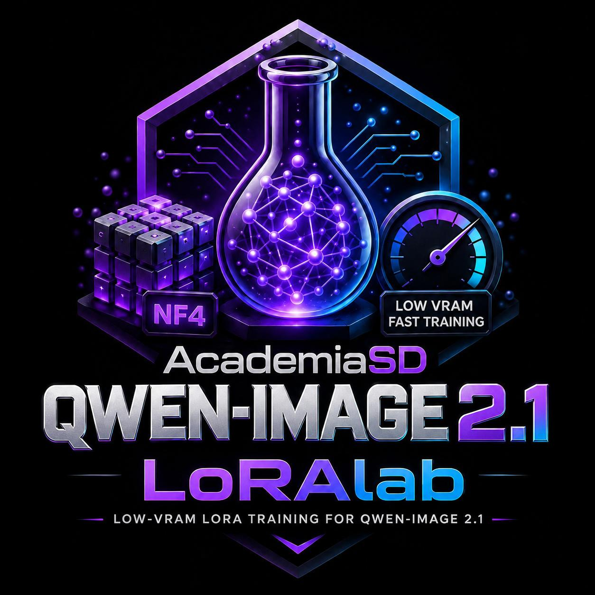

> Part of **AcademiaSD LoRAlab Trainer**: install once with `Install_LoRAlab.bat` and open this trainer from `Start_LoRAlab.bat` or `code\Run_LoRAlab-QwenImage21.bat`. / Parte de **AcademiaSD LoRAlab Trainer**: se instala una vez con `Install_LoRAlab.bat` y se abre desde `Start_LoRAlab.bat` o `code\Run_LoRAlab-QwenImage21.bat`.

# AcademiaSD Qwen-Image 2.1 LoRAlab



<p align="center">
  <b>A fast, low-resource Web GUI & pipeline for training Qwen-Image 2.1 (NF4) LoRAs: characters, objects, styles and edits.</b>
</p>

<p align="center">
  
  
  
  
</p>

All measurements below were taken on an **RTX 5080 (16 GB)**.

---

## ✨ Features

### Training
| Feature | Status |
| :--- | :--- |
| Character / object / style LoRAs (image + caption) | ✅ Verified — 512×512, rank 8/alpha 8, LR 4e-4, 500 steps: good likeness, no overfitting, clothes and backgrounds change freely. ~9 min 20 s (~1 s/step) |
| LoRA Type selector in Pre-Cache: **Normal** (image + caption) or **Edit** (`name_before` / `name_after` pairs + instruction) | ✅ Verified |
| Edit LoRAs (`name_before` / `name_after` pairs + instruction) | ✅ Verified — 30 pairs, 512×512, 300 steps, ~9 min (1.7 s/step): the style is learned and applied to an image outside the dataset |
| 768×768 / 1024×1024 training | ✅ Verified — 768²: 2.2 s/step, ~8.4 GB VRAM · 1024²: ~4.3 s/step, ~7.6–8.4 GB VRAM |
| NF4 transformer (7B) | ✅ Verified — loads in ~2 s, 3.9 GB VRAM, cosine 0.998–0.9996 vs BF16 |
| LoRA Targets: Blocks (attention + MLP, default) / All | ✅ Verified — Blocks combines cleanly with the Turbo LoRA |
| FP32 LoRA + AdamW, gradient checkpointing, cosine LR with warmup | ✅ Verified |
| Exact-step resume (uses the checkpoint's layers, rank and alpha) | ✅ Verified |
| Live settings while training (steps, save/preview every, preview settings, caption mode, turbo, LR) | ✅ Verified |
| Live preview **seed** | ✅ Verified |
| Live **custom preview prompt** and edit preview image (encoded on CPU while training, on GPU otherwise; buttons are locked until it finishes) | ✅ Verified |
| 8 GB GPUs | ✅ Verified — 512² and 768² (at 768² previews switch to a tiled VAE decode) |
| Batch size > 1 in edit LoRAs | ✅ Verified |

### Previews
| Feature | Status |
| :--- | :--- |
| Normal previews (default 30 steps, CFG 3) | ✅ Verified |
| Turbo previews with the [Viggle Turbo LoRA](https://huggingface.co/Viggle/Qwen-Image-2.1-viggle-turbo) (4 steps, CFG 1) | ✅ Verified — 5.3 s vs 33.7 s at 608×960 |
| Edit previews on a user image outside the dataset | ✅ Verified |

### Pre-cache & text encoder
| Feature | Status |
| :--- | :--- |
| Text encoder Qwen3-VL-8B: BF16 CPU offload (default), BF16, INT8, NF4 | ✅ Verified — per-token error vs BF16: INT8 ~9%, NF4 ~24% |
| RGBA VAE latents, 32-px buckets, no prompt truncation | ✅ Verified — VAE round trip 34–40 dB PSNR |
| Re-running pre-cache skips latents already cached | ✅ Verified |

### Dataset tools
| Feature | Status |
| :--- | :--- |
| Auto-captioner with Qwen3-VL-8B (the model's own text encoder, NF4): **Normal** and **Edit** modes | ✅ Verified — ~11 s/image, ~3 s/pair, ~6 GB VRAM |
| Dataset Manager: search, grid sizes, resizable grid, per-image delete, common text (append / replace / remove), clear captions | ✅ Verified |
| Delete Pre-Cache / Delete Training buttons | ✅ Verified (server) |
| `.parquet` extractor (edit pairs or single images, balanced, filtered by tags and colorfulness) | ✅ Verified |

### Export
| Feature | Status |
| :--- | :--- |
| LoRA in diffusers/PEFT format with per-layer `alpha` | ✅ Verified with ComfyUI's own LoRA loader (all layers mapped, incl. fused `gate_up`) |
| Metadata tags (`ss_*` kohya convention, trigger word for CivitAI) | ✅ Verified |
| One-click "Send to Models" | ✅ Verified |

### Install & update
| Feature | Status |
| :--- | :--- |
| `Install_LoRAlab-Qwen_Image21.bat` (Python 3.13 venv, PyTorch cu130, diffusers from GitHub) | ✅ Verified |
| `Run_LoRAlab-Qwen_Image21.bat` | ✅ Verified |
| Automatic model download from Hugging Face | ✅ Verified |
| `Update_LoRAlab-Qwen_Image21.bat` | ✅ Verified |

---

## 🔬 How it works

- **Two stages.** `1_pre_cache` encodes every caption with Qwen3-VL-8B and every image with the VAE once. `2_train_lora` never loads the text encoder or the VAE for training: 100% of the GPU goes to the DiT.
- **NF4 transformer, rebuilt directly.** The 224 attention/MLP layers are NF4; the shared `modulation`, `txt_in`, `img_in`, timestep embedder and output layers stay in BF16. The model is built empty and filled from the NF4 cache, with no BF16 copy.
- **Exact conditioning.** Captions are encoded like ComfyUI does at inference (last hidden layer before the final norm, system turn removed, no truncation), with the BF16 text encoder by default.
- **Edit LoRAs.** The "before" image goes through Qwen3-VL together with the instruction and is prepended to the sequence as clean latents; the loss is computed only on the "after", as in the ComfyUI `TextEncodeQwenImage21` node.

---

## 🖥️ System Requirements

| Requirement | Tested | Notes |
| :--- | :--- | :--- |
| **OS** | Windows 11 | |
| **GPU** | NVIDIA, **8 GB VRAM minimum** ✅ verified | Developed on an RTX 5080 16 GB |
| **RAM** | **16 GB minimum** (measured) | Training +4 GB, captioner +3 GB. Pre-Cache with 8 GB VRAM: NF4 text encoder +3 GB; the default BF16 needs ~12 GB free (32 GB RAM recommended). INT8 needs ≥ 10 GB VRAM. |
| **Python** | 3.13 (inside `venv`) | Installed automatically if missing |

Qwen-Image 2.1 needs `transformers>=5.17` and diffusers from GitHub, so this project uses its own virtual environment.

---

## 📦 Installation

1. Clone or download the repository.
2. Run `Install_LoRAlab-Qwen_Image21.bat`.
3. (Optional) Run `Install_Triton&SageAtten220.bat`.

---

## ⚡ Usage

1. Run `Run_LoRAlab-Qwen_Image21.bat` and open `http://127.0.0.1:5000`.
2. **Dataset**: pick the folder. For edit LoRAs, name the pairs `name_before.png` / `name_after.png` and write the instruction in `name.txt`.
3. **Captions** (optional): Create Captions in Normal or Edit mode, then review them in the Dataset Manager.
4. **Pre-Cache**: choose resolution and text encoder, then Start Pre-Cache.
5. **Train**: Start / Resume. Settings can be changed while training with Save JSON.
6. **Export**: Send to Models, or copy the `.safetensors` from the output folder.

### Starting point that worked
| | Characters | Edits |
| :--- | :--- | :--- |
| Resolution | 512×512 | 512×512 |
| Rank / Alpha | 8 / 8 | 8 / 8 |
| LR | 4e-4 | 4e-4 |
| Steps | 500 | 300 |
| LoRA Targets | Blocks | Blocks |

---

## 📁 Project Structure

```text
AcademiaSD_LoRAlab-Qwen_Image21/
├── 0_caption_qwen_image21.py        # Auto-captioner (Normal / Edit)
├── 1_pre_cache_qwen_image21.py      # Text embeddings + VAE latents
├── 2_train_lora_qwen_image21.py     # NF4 LoRA training
├── 5_conversor_QwenImage21_NF4.py   # Builds the NF4 model folder from the original
├── 6_extract_parquet.py             # Extracts datasets from .parquet files
├── server.py                        # Flask backend
├── trainer_ui.html                  # Web GUI
├── Install_LoRAlab-Qwen_Image21.bat
├── Install_Triton&SageAtten220.bat
├── Run_LoRAlab-Qwen_Image21.bat
└── Update_LoRAlab-Qwen_Image21.bat
```

---

## 💬 Community & Support

- ▶ **YouTube**: [youtube.com/@Academia_SD](https://www.youtube.com/@Academia_SD)
- 𝕏 **X (Twitter)**: [twitter.com/Academia_S_D](https://twitter.com/Academia_S_D)
- 💬 **Discord**: [discord.gg/Syuaduy678](https://discord.gg/Syuaduy678)
- ☕ **Ko-Fi**: [ko-fi.com/academiasd](https://ko-fi.com/academiasd)

---

## 📜 Credits & License

Developed with ❤️ by **AcademiaSD**. Built upon PyTorch, Diffusers, Transformers, PEFT, Bitsandbytes and Hugging Face Hub.

The code is MIT licensed. The Qwen-Image 2.1 weights, the NF4 conversion and the Viggle Turbo LoRA are under the **Qwen Research License**: **non-commercial use only**. Check its terms before sharing trained LoRAs.
