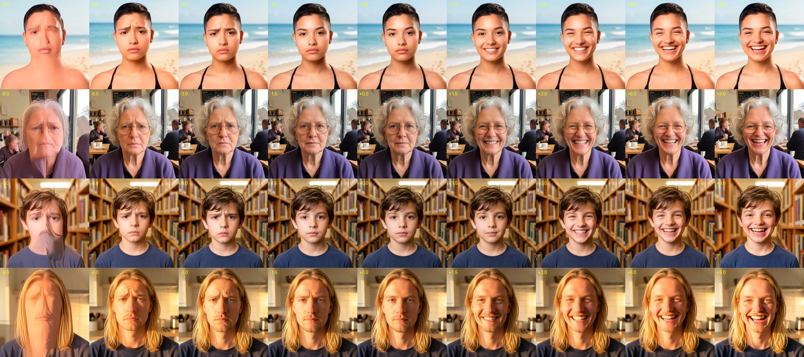

# Slider LoRAs for FLUX.2 Klein 9B (edit) — prototype

> 🧪 Experimental, not part of the trainers yet. It works and is documented here so it can become a **"Slider"** LoRA type in the Klein 9B trainer (and later Qwen-Image 2.1).

A slider is a LoRA whose **strength is a dial between two looks**. With a fixed prompt, `Keep the photo exactly as it is.`, the strength alone decides the result on any photo: negative → sad, 0 → unchanged, positive → happy.



<p align="center"><i>Best result (test B) on 4 people not in the dataset. Columns: −9 / −6 / −3 / −1.5 / 0 / +1.5 / +3 / +6 / +9.</i></p>

## Recipe that works

1. **Synthetic pairs** made with Klein itself (`gen_pairs.py`): 24 varied portraits with a neutral face, then a happy and a sad edit of each, with the same face, background and light. People 20–23 are kept out for testing.
2. **The same neutral caption for every pair**, `Keep the photo exactly as it is.`. The text gives no hint, so the effect has to live in the LoRA. With a caption like "Make the person happy" the base model already does the edit and the strength does almost nothing (phase 1).
3. **Both directions in one training:** pairs named `name_pos` are trained with the LoRA at **+push** and `name_neg` at **−push**.
4. **Anchors** (`gen_anchors.py`): 12 scenes with no people, before = after, trained at a random ±push. They teach the LoRA not to touch what isn't a face: no zoom, reframing or light shift. An anchor with the same neutral face would contradict the pairs, so they must be different images.
5. **Rank 4, push 3:** one direction needs little capacity, and low rank leaves no room for side effects. Push 3 gives a ±5-style scale.
6. **"Ultra" (optional, best):** LoRA only on the 8 double blocks (text–image fusion) and the first 8 single blocks (composition), leaving the fine-detail blocks alone. The dial holds much higher strengths.

## Results

512×512, LR 2e-4, Klein 9B NF4, ~2.2 s/step on an RTX 5080 16 GB (~45 min for 1,200 steps).

| Test | Setup | Usable range | Where it breaks | Sheet |
| :--- | :--- | :--- | :--- | :--- |
| Phase 1 | normal edit LoRA, caption "Make the person happy." | not a slider | the text does the edit, not the strength | [phase1](results/phase1_edit_lora.jpg) |
| Phase 2 | rank 16, push 1, all blocks, no anchors | −1.5 … +2 | −2: zoom and a doubled face; +2: warmer light | [phase2](results/phase2_rank16_push1.jpg) |
| A | rank 4, push 3, anchors, all blocks (144 layers) | −6 … +6 | ±9: washed-out image | [testA](results/testA_rank4_push3_anchors.jpg) |
| **B** | **rank 4, push 3, anchors, ultra (112 layers)** | **−6 … +9** | −9: deformed face | [testB](results/testB_ultra.jpg) |

The sad side breaks earlier because the generated sad faces are milder than the happy ones.

## Files

| File | What it does |
| :--- | :--- |
| `gen_pairs.py` | Generates `work/pairs/pXX_neutral|happy|sad.png` with Klein 9B NF4 + its turbo LoRA (4 steps, ~12 s per person) |
| `gen_anchors.py` | Generates `work/anchors/aXX.png`, scenes without people |
| `make_slider_trainer.py` | Writes `work/train_slider_klein9b.py`: a copy of `scripts/2_train_lora_klein9b.py` with the slider changes (about 20 lines) |
| `test_slider.py` | Strength sweep of a trained LoRA on the 4 held-out people → one sheet |
| `results/` | Sheets of every test, and `dataset_pairs.jpg` (the 24 triplets) |

Everything generated goes to `experiments/slider/work/` (not in git). `SLIDER_WORK` changes that folder.

### Slider options of the prototype trainer (environment variables)

- `SLIDER_PUSH` (default 3): strength the LoRA is trained at. In ComfyUI, strength `push` reproduces the dataset's edit.
- `SLIDER_ULTRA=1`: only the 8 double blocks + the first 8 single blocks.
- Pair names: `name_pos_before/after` → +push, `name_neg_before/after` → −push, `name_anc_before/after` (anchor) → random ±push.

## Reproduce

Run from the repo root with the Trainer Studio venv, on an NVIDIA GPU (Klein 9B NF4 is downloaded by the normal trainer).

```bash
python experiments/slider/gen_pairs.py
python experiments/slider/gen_anchors.py
python experiments/slider/make_slider_trainer.py
```

Then build a run folder (for example `work/run_ultra/`) with:

- `ds/`: for people p00–p19, `pXX_pos_before.png` (neutral) + `pXX_pos_after.png` (happy), and `pXX_neg_before.png` (neutral) + `pXX_neg_after.png` (sad). Add each anchor as `aXX_anc_before.png` + `aXX_anc_after.png` (the same image). Every pair gets a `.txt` with `Keep the photo exactly as it is.`
- `settings/pre_cache_settings_klein9b.json`: `{"dataset_path": "./ds", "project_name": "slider", "target_area": 262144, "max_side": 1024, "multiple": 16, "lora_type": "edit", "preview_custom_prompt": "Keep the photo exactly as it is."}`
- `settings/train_settings_klein9b.json`: `{"project_name": "slider", "total_steps": 1200, "grad_accum_steps": 1, "lr": 2e-4, "warmup_steps": 50, "lora_rank": 4, "lora_alpha": 4, "save_every": 400, "preview_every": 0, "seed": 42}`
- `FLUX.2-Klein-9B_NF4`: a link (junction on Windows) to the model folder of the installation.

From the run folder: `scripts/1_pre_cache_klein9b.py`, then `SLIDER_PUSH=3 SLIDER_ULTRA=1 python <work>/train_slider_klein9b.py`, and finally:

```bash
STRENGTHS="-9,-6,-3,-1.5,0,1.5,3,6,9" PROMPTS="Keep the photo exactly as it is." python experiments/slider/test_slider.py <run>/klein9b_lora_output_slider/resume_checkpoint <run>/sheet.jpg
```

## Next steps

1. **Balance and grade the dataset:** make the sad edits as strong as the happy ones, and add a mild level per side trained at ±push/2 (names such as `_pos2` / `_neg2`), so the dial is linear and the sad side holds as far as the happy one.
2. **"Slider" LoRA type in the Klein trainer:** the three pair kinds (`_pos`, `_neg`, `_anc`), the Push and Ultra fields in the UI, rank 4 as the default, and the README section.
3. **Built-in pair generator:** type the two ends ("happy" / "sad") and Klein builds the dataset, as `gen_pairs.py` does.
4. **Port it to Qwen-Image 2.1** (edit trainer) once Klein is done.

## Credits

- The idea of training a LoRA in both directions comes from **[Concept Sliders](https://sliders.baulab.info/)** (Gandikota et al.).
- The push strength, the low rank and training only the composition blocks ("ultra") follow what **[Fizgig](https://github.com/shootthesound/Fizgig)** by [@shootthesound](https://github.com/shootthesound) describes for its slider LoRAs. No Fizgig code is used here.
- Turbo previews and pair generation use the Klein 9B turbo LoRA by [kalle07](https://huggingface.co/kalle07/FLUX.2-klein-9B-turbo-lora-set).
